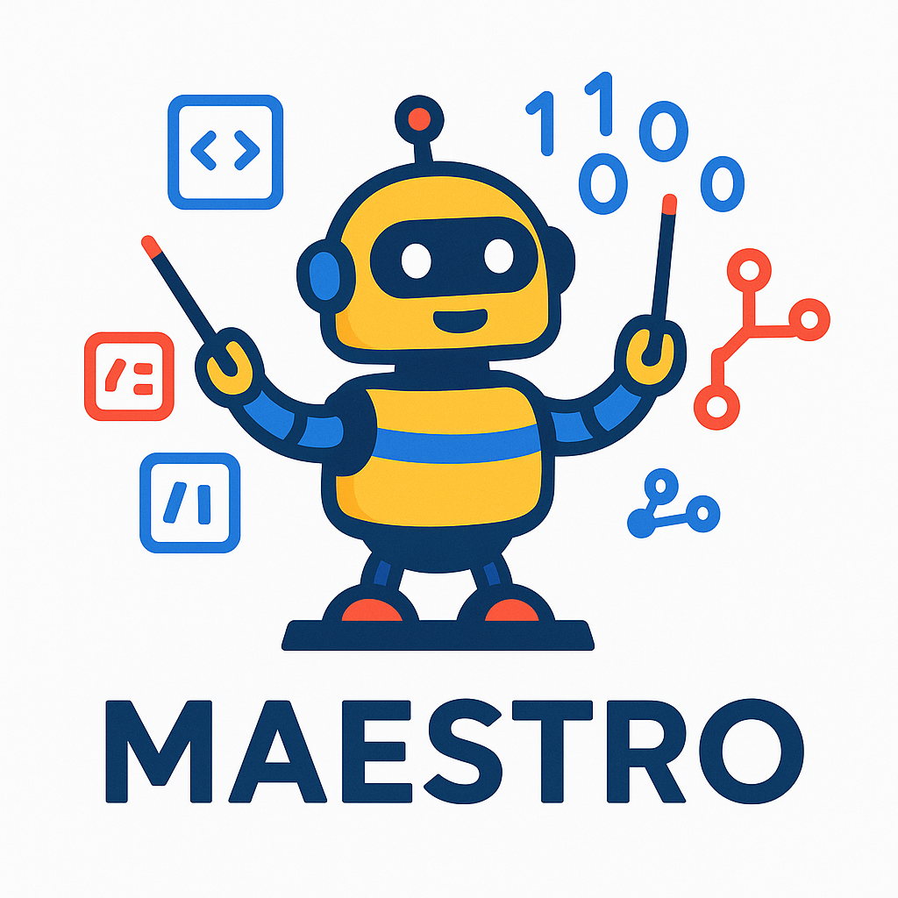

# Multi-Agent AI Coding System Orchestrator

A Go-based orchestrator that coordinates between Architect Agents (o3) and Coding Agents (Claude) to process development stories and implement code changes.

## Overview

This system implements a message-passing architecture where:
- **Architect agents** read development stories and create TASK messages
- **Coding agents** process tasks and return RESULT/ERROR/QUESTION messages
- The **orchestrator** manages agent communication with rate limiting and event logging

## Requirements

### System Requirements

- **Go**: Version 1.24+ required for building the orchestrator
- **Git**: Required for worktree management and code review workflows
- **Make**: Required for build commands
- **Docker**: Version 20.10+ for sandboxed AI agent execution (recommended)
- **Platform**: Linux, macOS, or Windows with Docker Desktop
- **Resources**: Minimum 2GB RAM, 1 CPU core available for containers

### Docker Sandboxing

The system uses Docker containers by default to provide secure, isolated execution environments for AI agents:

- **Security**: Prevents agents from accessing files outside their workspace
- **Isolation**: Each agent runs in a separate container with resource limits
- **Compatibility**: Supports git worktrees and architect code review workflows

For detailed information about Docker sandboxing, see [README_SANDBOX.md](README_SANDBOX.md).

### Environment Variables

Required environment variables for AI model access:

```bash
# For Claude coding agents
export ANTHROPIC_API_KEY=your_anthropic_api_key

# For OpenAI o3 architect agents  
export OPENAI_API_KEY=your_openai_api_key

# Optional: Custom configuration file path
export CONFIG_PATH=/path/to/config.json
```


## Quick Start

### Building the System

```bash
# Build the orchestrator
make build

# Run tests
make test

# Lint code
make lint

# Start the orchestrator
make run
```

### Web UI

The orchestrator includes a built-in web UI for monitoring and managing multi-agent workflows in real-time.

#### Starting the Web UI

```bash
# Start with web UI on port 8080
./bin/orchestrator -ui

# Start with custom working directory
./bin/orchestrator -ui -workdir=/path/to/workspace

# Development mode with temporary workspace
make ui-dev
```

The web UI will be available at `http://localhost:8080` and automatically opens in your browser.

#### Web UI Features

**Agent Monitoring:**
- Real-time agent status grid showing ID, role, state, and last update time
- Click on any agent card to view detailed information including:
  - Current implementation plan
  - Task content being processed
  - State transition history
- Color-coded states: WAITING (blue), WORKING (yellow), DONE (green), ERROR (red), ESCALATED (purple)

**Queue Management:**
- Expandable queue viewer for architect, coder, and shared work queues
- Real-time message counts and queue status
- Message inspection showing ID, type, from/to agents, and timestamps
- Automatic polling when queues are expanded

**Specification Upload:**
- Drag-and-drop or click to upload `.md` specification files
- File validation (max 100KB, markdown files only)
- Automatic routing to architect agent when in WAITING state
- Upload status feedback and error handling

**System Logs:**
- Real-time log streaming with domain filtering (architect, coder, dispatch)
- Auto-scroll option for continuous monitoring
- Log level color coding (ERROR: red, WARN: yellow, INFO: blue, DEBUG: gray)
- Clear logs functionality

**Escalation Management:**
- Banner notification when agents require human intervention
- Modal view for reviewing escalated questions and providing answers
- Integration with architect escalation system

**System Controls:**
- Graceful shutdown via web interface
- Real-time connection status indicator
- Last updated timestamp
- Offline detection with retry mechanism

#### Web UI Architecture

- **Backend**: Go HTTP server integrated into orchestrator binary
- **Frontend**: Vanilla JavaScript with Tailwind CSS
- **Polling**: 1-second intervals for real-time updates
- **Static Assets**: CSS and JS served from `/static/` route
- **Templates**: Go html/template system for server-side rendering

#### Development

```bash
# Build CSS from Tailwind source
make build-css

# Start in development mode with temporary workspace
make ui-dev

# Rebuild and restart
make build ui-dev
```

The web UI provides a comprehensive dashboard for monitoring multi-agent workflows, making it easy to track progress, debug issues, and manage the system without command-line interaction.

### Running Individual Agents with AgentCtl

The `agentctl` tool allows you to run individual agents in isolation for testing and development.

#### Canonical Usage

```bash
# Canonical format (defaults to coder agent and live mode with API key fallback)
./bin/agentctl run [coder|architect] --input <file.json> [--workdir <dir>] [--mode <mock|live|debug>] [--cleanup]

# Simple examples
./bin/agentctl run --input tests/fixtures/test_task.json                    # Default: coder, auto-detect mode
./bin/agentctl run coder --input tests/fixtures/test_task.json             # Explicit coder agent
./bin/agentctl run architect --input stories/001.md --mode mock            # Architect in mock mode
./bin/agentctl run coder --input task.json --workdir ./work/tmp --cleanup  # Custom workdir with cleanup
```

#### Mode Auto-Detection

The tool automatically detects the best mode based on available API keys:
- **live mode**: Used if `ANTHROPIC_API_KEY` or `OPENAI_API_KEY` environment variables are set
- **mock mode**: Fallback when no API keys are available (shows informational message)
- **debug mode**: Explicit debugging mode (specify with `--mode debug`)

#### Workspace Management

- **Default behavior**: Working directories are preserved after execution for inspection
- **Cleanup**: Use `--cleanup` flag to remove temporary directories after execution
- **Auto-generated**: If `--workdir` is not specified, creates temporary directories automatically

#### Architect Commands

The architect agent provides additional commands for managing escalations and monitoring:

```bash
# List all escalations requiring human intervention
./bin/agentctl architect list-escalations

# Filter escalations by status
./bin/agentctl architect list-escalations --status pending
./bin/agentctl architect list-escalations --status resolved

# Output in JSON format for programmatic use
./bin/agentctl architect list-escalations --format json

# Specify custom work directory
./bin/agentctl architect list-escalations --workdir /path/to/project/logs
```

#### Agent Types

- **coder** (default) - Process coding tasks and generate implementations
  - Input: TASK JSON messages
  - Output: RESULT JSON with generated code and test results
  - Modes: mock, live (with `ANTHROPIC_API_KEY`)

- **architect** - Process development stories and generate task messages
  - Input: Markdown story files (`.md`)
  - Output: TASK JSON messages with requirements and implementation details
  - Modes: mock (live mode not yet implemented)
  - Additional Commands: `list-escalations` for monitoring business questions and review failures

#### Modes

- **auto-detect** - Automatically choose live or mock based on API key presence (default)
- **mock** - Use mock implementations (fast, no API calls)
- **live** - Use real API calls (requires environment variables)
- **debug** - Enhanced debugging mode with additional logging

#### Environment Variables for Live Mode

```bash
# For coder agent live mode
export ANTHROPIC_API_KEY="your-anthropic-api-key"

# For architect agent live mode (when implemented)
export OPENAI_API_KEY="your-openai-api-key"

# Auto-detection works with either key present
# Tool will inform you when falling back to mock mode
```

#### Examples

```bash
# Basic coder usage (auto-detects mode, preserves workdir)
./bin/agentctl run --input tests/fixtures/test_task.json

# Explicit coder with custom workdir and cleanup
./bin/agentctl run coder --input tests/fixtures/test_task.json --workdir ./work/tmp --cleanup

# Architect in mock mode (live mode not yet implemented)
./bin/agentctl run architect --input stories/001.md --mode mock

# Force mock mode even with API keys present
./bin/agentctl run coder --input task.json --mode mock

# Debug mode with enhanced logging
./bin/agentctl run coder --input task.json --mode debug

# Run full orchestrator flow with all agents using test spec
./bin/orchestrator --spec tests/fixtures/test_spec.md

# Monitor architect escalations (business questions, review failures)
./bin/agentctl architect list-escalations --status pending
./bin/agentctl architect list-escalations --format json --workdir ./project/logs
```

#### Sample Task JSON Format

For testing the coder agent, create a task JSON file in the `tests/fixtures/` directory:

```json
{
  "id": "test_msg_001",
  "type": "TASK", 
  "from_agent": "architect",
  "to_agent": "coder",
  "timestamp": "2025-06-10T19:00:00Z",
  "payload": {
    "content": "Create a simple health endpoint that returns JSON with status and timestamp",
    "requirements": [
      "GET /health endpoint",
      "Return JSON response",
      "Include timestamp"
    ]
  }
}
```

## System Architecture

### Core Components

- **Task Dispatcher** (`pkg/dispatch/`) - Routes messages between agents with rate limiting and channel-based notifications
- **Agent Message Protocol** (`pkg/proto/`) - Structured communication via `AgentMsg` with types: TASK, RESULT, ERROR, QUESTION, ANSWER, REQUEST, SHUTDOWN
- **Rate Limiting** (`pkg/limiter/`) - Token bucket per-model rate limiting with daily budget enforcement
- **Event Logging** (`pkg/eventlog/`) - Structured logging to `logs/events.jsonl` with daily rotation
- **Configuration** (`pkg/config/`) - JSON config loader with environment variable overrides
- **Agent Foundation** (`pkg/agent/`) - Core LLM abstractions, state machine interfaces, and foundational components
- **Coder State Machine** (`pkg/coder/`) - Coder-specific state machine for structured coding workflows  
- **Architect State Machine** (`pkg/architect/`) - Architect-specific state machine for spec processing and coordination
- **Template System** (`pkg/templates/`) - Prompt templates for different workflow states
- **MCP Tool Integration** (`pkg/tools/`) - Model Context Protocol tools for file operations in workspaces

### Channel-Based Architecture (Phase 6)

The system uses a sophisticated channel-based communication pattern for real-time coordination:

**Dispatcher Channels:**
- `SubscribeIdleAgents()` - Architect subscription to real-time idle agent notifications
- Pull-based message queues (shared work, architect work, coder feedback)
- Agent state tracking with busy/idle transitions
- Graceful shutdown with proper channel cleanup

**Architect Worker Channels:**
- `readyStoryCh` - Queue notifications when stories become ready (buffered, size 1)
- `idleAgentCh` - Dispatcher notifications when agents become available (buffered, size 10) 
- `reviewDoneCh` - Review worker completion signals (buffered, size 1)
- `questionAnsweredCh` - Answer worker completion signals (buffered, size 1)

**Message Flow:**
1. **Task Assignment**: `TASK` → shared work queue → agent pull → mark busy
2. **Completion Notification**: `RESULT` with completion status → mark idle → notify architect
3. **Question/Answer**: `QUESTION` → architect queue → answer worker → `ANSWER` → coder queue
4. **Review Process**: `REQUEST` → architect queue → review worker → `RESULT` → coder queue

### Agent Flow (Phase 6 Architecture)

1. **Architect Workflow** - Processes development specifications through state machine:
   - **SPEC_PARSING**: Parse specification files into requirements using LLM or deterministic parser
   - **STORY_GENERATION**: Generate story files from requirements with dependency tracking
   - **QUEUE_AND_DISPATCH**: Merged state that manages story queue and dispatches ready stories:
     - Load stories and detect dependency cycles
     - Listen on channels for ready stories (`readyStoryCh`) and idle agents (`idleAgentCh`)
     - Assign stories to available coding agents through dispatcher
     - Handle completion via channel notifications
   - **AWAIT_HUMAN_FEEDBACK**: Handle business escalations requiring human intervention
   - **DONE**: Workflow completed successfully

2. **Coder Workflow** - Implements stories through v2 FSM:
   - **WAITING**: Idle state, waiting for task assignment
   - **PLANNING**: Analyze task requirements and create implementation plan
   - **PLAN_REVIEW**: Request architect approval of implementation plan (REQUEST→RESULT flow)
   - **CODING**: Generate code using MCP tools to create files in workspace
   - **TESTING**: Run formatting, building, and tests on generated code
   - **FIXING**: Apply fixes when tests fail, return to TESTING
   - **CODE_REVIEW**: Request architect approval of code implementation (REQUEST→RESULT flow)
   - **QUESTION**: Ask architect technical questions with origin tracking (QUESTION→ANSWER flow)
   - **DONE**: Task completed successfully

3. **Channel-Based Coordination**:
   - **Answer Worker**: Long-running goroutine handles QUESTION messages using LLM
   - **Review Worker**: Long-running goroutine performs automated code review with quality checks
   - **Real-time Notifications**: Dispatcher immediately notifies architect when agents become idle
   - **Pull-based Queues**: Agents actively pull work from dispatcher queues

4. **System Features**: Event logging, escalation tracking, agent state persistence, graceful shutdown

## Configuration

The system uses JSON configuration with environment variable overrides:

```json
{
  "models": {
    "claude_sonnet4": {
      "max_tokens_per_minute": 5000,
      "max_budget_per_day_usd": 50.0,
      "api_key": "${ANTHROPIC_API_KEY}",
      "agents": [
        {"name": "claude-coder", "id": "001", "type": "coder", "workdir": "./work/claude"}
      ]
    },
    "openai_o3": {
      "max_tokens_per_minute": 2000,
      "max_budget_per_day_usd": 20.0, 
      "api_key": "${OPENAI_API_KEY}",
      "agents": [
        {"name": "architect", "id": "001", "type": "architect", "workdir": "./work/architect"}
      ]
    }
  },
  "repo_url": "git@github.com:user/repo.git",
  "base_branch": "main",
  "mirror_dir": ".mirrors",
  "worktree_pattern": "{AGENT_ID}/{STORY_ID}",
  "branch_pattern": "story-{STORY_ID}"
}
```

### Git Worktree Support (Worktree MVP)

The system supports Git worktrees for isolated agent workspaces, enabling multiple concurrent story development:

**Story File Naming Constraint**: Story files MUST follow the pattern `{ID}.md` (e.g., `050.md`, `123.md`). The filename becomes the canonical story identifier and Git branch name. Invalid examples: `R-12345_login.md` → unclear story ID extraction.

**Startup Sequence**:
1. **Parse configuration** from `CONFIG_PATH` or `--config` flag
2. **Create WORKDIR** if missing (from config or CLI argument)  
3. **Initialize Git mirrors** lazily in `{WORKDIR}/.mirrors/` subdirectory
4. **Start agents** with workspace managers configured

**Git Configuration**:
- `repo_url`: SSH repository URL for clone/push operations
- `base_branch`: Base branch for worktree creation (default: `main`)
- `mirror_dir`: Mirror repository location relative to WORKDIR (default: `.mirrors`)
- `worktree_pattern`: Workspace path template (default: `{AGENT_ID}/{STORY_ID}`)
- `branch_pattern`: Git branch naming (default: `story-{STORY_ID}`)

**Workspace Flow**:
1. **SETUP**: Create mirror clone (if needed), add worktree, create story branch
2. **Code Development**: Generate code in isolated workspace
3. **TESTING**: Run `make test` in worktree directory  
4. **Branch Push**: Push story branch for review (if `GITHUB_TOKEN` available)
5. **Cleanup**: Remove worktree after completion, prepare for next story

This enables agents to work on multiple stories sequentially with proper isolation and cleanup.

## Development Stories

The system follows story-driven development with ordered implementation stories:

- **Stories 001-012**: MVP implementation (completed)
- **Stories 013-019**: Phase 2 - Real LLM integrations and standalone testing tools (completed)  
- **Stories 040-046**: Phase 4 - Architect Agent Core Workflow (completed)
- **Stories 060-064**: Phase 6 - Refactor & State-Machine Alignment (completed)
  - Story 060: Repository refactor to new package layout
  - Story 061: Coding Agent driver update to v2 FSM  
  - Story 062: Architect driver update (merged queue/dispatch + channels)
  - Story 063: Dispatcher & channel wiring with production-ready agent state tracking
  - Story 064: Documentation & diagram sync

See `PROJECT.md`, `PHASE2.md`, `PHASE4.md`, and `PHASE6.md` for detailed story specifications.

## Testing

```bash
# Run all tests
go test ./...

# Run end-to-end smoke test
go test -v . -run TestE2ESmokeTest

# Test individual agents (using files in tests/fixtures/)
./bin/agentctl run architect --input stories/001.md --mode mock
./bin/agentctl run coder --input tests/fixtures/test_task.json --mode mock

# Test live mode with workspace (auto-detects mode)
./bin/agentctl run coder --input tests/fixtures/test_task.json --workdir ./work/tmp

# Test architect escalation commands
./bin/agentctl architect list-escalations
./bin/agentctl architect list-escalations --status pending --format json
```

## Directory Structure

```
orchestrator/
├── cmd/             # Command-line tools
│   ├── agentctl/    # Standalone agent runner CLI
│   └── replayer/    # Event log replay tool
├── config/          # Configuration files
├── docs/            # Documentation and style guides
├── logs/            # Runtime event logs (generated)
├── pkg/             # Core packages (Phase 6 clean architecture)
│   ├── agent/       # Foundational abstractions: LLM clients, state machine building blocks
│   ├── architect/   # Architect agent: spec processing, story generation, coordination state machine
│   ├── coder/       # Coder agent: implementation workflows, coding state machine
│   ├── config/      # Configuration: JSON loader with environment variable overrides
│   ├── contextmgr/  # Context management for LLM conversations
│   ├── dispatch/    # Message routing: queue management, rate limiting, channel notifications
│   ├── eventlog/    # Structured logging to logs/events.jsonl with daily rotation
│   ├── limiter/     # Token bucket rate limiting with daily budget enforcement
│   ├── logx/        # Structured logging utilities
│   ├── proto/       # Message protocol: AgentMsg definitions and validation
│   ├── state/       # Agent state storage and recovery
│   ├── templates/   # Prompt templates: reusable LLM prompt templates
│   ├── testkit/     # Testing utilities and helpers
│   ├── tools/       # MCP integration: Model Context Protocol tool implementations
│   └── webui/       # Web UI server: HTTP API and dashboard for monitoring agents
├── status/          # Agent status reports (generated)
├── stories/         # Generated story files from specifications
├── tests/           # Test files and fixtures
│   └── fixtures/    # Test input files (JSON, MD)
├── web/             # Web UI frontend assets
│   ├── static/      # Static assets (CSS, JavaScript)
│   │   ├── css/     # Compiled Tailwind CSS
│   │   └── js/      # Frontend JavaScript
│   └── templates/   # Go HTML templates
└── work/            # Agent workspace directories with isolated state
```

## License

See project documentation for license information.