# Maestro Knowledge Graph Implementation Spec

## Overview

Implement a knowledge graph system that captures architectural patterns, components, and decisions to reduce review cycles and improve code consistency across agent-generated code. The system uses DOT format for storage and SQLite for indexing, with integration points throughout the agent workflow.

## Architecture Decisions

This spec has been reviewed and updated with clarifications from implementation planning. Key decisions:

**Database Consolidation**: Knowledge tables are added to the existing `maestro.db` database at `<projectDir>/.maestro/maestro.db` rather than creating a separate `knowledge.db`. This provides:
- Single database connection to manage
- Transactional consistency across all tables
- Simpler backup/recovery
- Consistent session isolation pattern
- Fits existing persistence queue architecture

**Session Isolation**: All knowledge tables include `session_id` field for consistency with existing database schema (schema version 7+).

**Workspace Path Resolution**: Coders work in `<projectDir>/coder-{id}/` (cloned repositories). They edit `.maestro/knowledge.dot` in their workspace, commit changes to a branch, and merge via PR like any code change. Architect has its own workspace clone at `<projectDir>/architect-001/` (updated at merge time alongside mirrors), mounted read-only at `/mnt/architect` in architect container. During SCOPING, architect reads from `/mnt/architect/.maestro/knowledge.dot` using normal file operations.

**Validation**: Knowledge graph files (`.maestro/knowledge.dot`) receive deterministic format validation, unlike other repository files. This ensures graph integrity before merge.

**Parser Strategy**: Use existing DOT parser library (evaluated: `github.com/awalterschulze/gographviz` or similar) for correctness, with fallback to custom parser only if needed.

**Pack Size Limits**: No hard limit enforcement for MVP. Instead, measure `knowledge_retrieve` tool latency via existing tool execution metrics in database. If pack becomes too large during submission, reject with instruction to "summarize relevant patterns" before sending to architect.

**Tool Schema Update**: The `plan_approval_request` tool must be updated to include `knowledge_pack` field in its schema. The `done` tool pulls pack from state data (KeyKnowledgePack).

**Search Algorithm**: Frequency-based term extraction with stop word filtering and identifier preservation. Top 20 terms by frequency from story description and acceptance criteria.

## File Structure

```
<repoRoot>/.maestro/
├── knowledge.dot       # Primary knowledge graph (git-committed)
└── README.md          # Human-readable explanation

<projectDir>/.maestro/
└── maestro.db         # SQLite database (includes knowledge tables)

<projectDir>/architect-001/  # Architect workspace (cloned repository, updated at merge time)
└── .maestro/
    └── knowledge.dot   # Read-only access to latest main branch

<projectDir>/coder-001/  # Coder workspace (cloned repository)
└── .maestro/
    └── knowledge.dot   # Edited by coder, committed to branch, merged to main
```

**Path Resolution**:
- Coders work in `<projectDir>/coder-{id}/` which are cloned repositories
- Knowledge edits happen in `<projectDir>/coder-001/.maestro/knowledge.dot` (part of repo)
- Changes are committed, reviewed via PR, and merged to main like any code change
- Architect has dedicated workspace at `<projectDir>/architect-001/` (updated at merge time)
- Architect workspace mounted read-only at `/mnt/architect` in architect container
- Architect reads from `/mnt/architect/.maestro/knowledge.dot` during SCOPING using normal file operations
- Architect workspace updated before SCOPING and after each successful merge

## Database Schema

Add these tables to existing `maestro.db` at `<projectDir>/.maestro/maestro.db`:

```sql
-- Node index
CREATE TABLE IF NOT EXISTS nodes (
    id TEXT PRIMARY KEY,
    session_id TEXT NOT NULL,  -- Session isolation
    type TEXT NOT NULL,        -- component|interface|abstraction|datastore|external|pattern|rule
    level TEXT NOT NULL,       -- architecture|implementation
    status TEXT NOT NULL,      -- current|deprecated|future|legacy
    description TEXT NOT NULL,
    tag TEXT,
    component TEXT,
    path TEXT,
    example TEXT,
    priority TEXT,             -- critical|high|medium|low (for rules only)
    raw_dot TEXT NOT NULL      -- Full DOT node definition for reconstruction
);

-- Edge index
CREATE TABLE IF NOT EXISTS edges (
    from_id TEXT NOT NULL,
    to_id TEXT NOT NULL,
    session_id TEXT NOT NULL,  -- Session isolation
    relation TEXT NOT NULL,    -- calls|uses|implements|configured_with|must_follow|must_not_use|superseded_by|supersedes|coexists_with
    note TEXT,
    PRIMARY KEY (from_id, to_id, relation)
);

-- Cached knowledge packs (story-specific subgraphs)
CREATE TABLE IF NOT EXISTS knowledge_packs (
    story_id TEXT PRIMARY KEY,
    session_id TEXT NOT NULL,  -- Session isolation
    subgraph TEXT NOT NULL,    -- DOT format subgraph
    created_at TIMESTAMP DEFAULT CURRENT_TIMESTAMP,
    last_used TIMESTAMP DEFAULT CURRENT_TIMESTAMP,
    node_count INTEGER,
    search_terms TEXT          -- Original search terms for debugging
);

-- Knowledge graph metadata (file modification tracking)
CREATE TABLE IF NOT EXISTS knowledge_metadata (
    id INTEGER PRIMARY KEY CHECK (id = 1), -- Singleton table
    session_id TEXT NOT NULL,
    dot_file_mtime INTEGER NOT NULL,       -- Unix timestamp of last known modification
    last_indexed_at TIMESTAMP DEFAULT CURRENT_TIMESTAMP
);

-- Full-text search index
CREATE VIRTUAL TABLE IF NOT EXISTS nodes_fts USING fts5(
    id, tag, description, path, example,
    content=nodes
);

-- FTS sync triggers (keep FTS table in sync with nodes table)
CREATE TRIGGER IF NOT EXISTS nodes_fts_insert AFTER INSERT ON nodes BEGIN
    INSERT INTO nodes_fts(rowid, id, tag, description, path, example)
    VALUES (new.rowid, new.id, new.tag, new.description, new.path, new.example);
END;

CREATE TRIGGER IF NOT EXISTS nodes_fts_update AFTER UPDATE ON nodes BEGIN
    UPDATE nodes_fts SET
        id = new.id,
        tag = new.tag,
        description = new.description,
        path = new.path,
        example = new.example
    WHERE rowid = new.rowid;
END;

CREATE TRIGGER IF NOT EXISTS nodes_fts_delete AFTER DELETE ON nodes BEGIN
    DELETE FROM nodes_fts WHERE rowid = old.rowid;
END;

-- Performance indices
CREATE INDEX IF NOT EXISTS idx_nodes_session ON nodes(session_id);
CREATE INDEX IF NOT EXISTS idx_nodes_type ON nodes(type);
CREATE INDEX IF NOT EXISTS idx_nodes_level ON nodes(level);
CREATE INDEX IF NOT EXISTS idx_nodes_status ON nodes(status);
CREATE INDEX IF NOT EXISTS idx_nodes_component ON nodes(component);
CREATE INDEX IF NOT EXISTS idx_edges_session ON edges(session_id);
CREATE INDEX IF NOT EXISTS idx_edges_from ON edges(from_id);
CREATE INDEX IF NOT EXISTS idx_edges_to ON edges(to_id);
CREATE INDEX IF NOT EXISTS idx_packs_session ON knowledge_packs(session_id);
CREATE INDEX IF NOT EXISTS idx_packs_last_used ON knowledge_packs(last_used);
```

**Schema Version**: This requires incrementing `CurrentSchemaVersion` to 10 in `pkg/persistence/schema.go` and adding `migrateToVersion10()` function.

## Default Knowledge Graph

```dot
digraph ProjectKnowledge {
    // Core architectural patterns
    "error-handling" [
        type="pattern"
        level="implementation"
        status="current"
        description="Wrap errors with context using errors.Wrap()"
        example="return errors.Wrap(err, \"failed to fetch user\")"
    ];
    
    "api-standards" [
        type="rule"
        level="architecture"
        status="current"
        description="REST APIs follow OpenAPI 3.0 specification"
        priority="high"
    ];
    
    "test-coverage" [
        type="rule"
        level="implementation"
        status="current"
        description="Maintain minimum 80% test coverage"
        priority="critical"
    ];
    
    "code-style" [
        type="pattern"
        level="implementation"
        status="current"
        description="Follow language-specific style guides (gofmt, prettier, etc.)"
    ];
}
```

If `<repoRoot>/.maestro/knowledge.dot` doesn't exist, create with defaults:



## Parser and Indexer

### DOT Parser (`pkg/knowledge/parser.go`)

```go
type Node struct {
    ID          string
    Type        string
    Level       string
    Status      string
    Description string
    Tag         string
    Component   string
    Path        string
    Example     string
    Priority    string
    RawDOT      string
}

type Edge struct {
    FromID   string
    ToID     string
    Relation string
    Note     string
}

type Graph struct {
    Nodes map[string]*Node
    Edges []*Edge
}

func ParseDOT(content string) (*Graph, error)
func (g *Graph) ToDOT() string
func (g *Graph) Validate() []ValidationError
func (g *Graph) Filter(predicate func(*Node) bool) *Graph
func (g *Graph) Subgraph(nodeIDs []string, depth int) *Graph
```

### Indexer (`pkg/knowledge/indexer.go`)

```go
// IndexGraph inserts/updates graph nodes and edges in the database.
// Uses session_id from config for all inserts.
func IndexGraph(db *sql.DB, graph *Graph, sessionID string) error

// RebuildIndex clears existing knowledge tables and rebuilds from DOT file.
func RebuildIndex(db *sql.DB, dotPath string, sessionID string) error

// IsGraphModified checks if the DOT file has been modified since last index.
// Compares file mtime with knowledge_metadata.dot_file_mtime.
func IsGraphModified(db *sql.DB, dotPath string) (bool, error)

// UpdateMetadata stores the current file mtime and index timestamp.
func UpdateMetadata(db *sql.DB, dotPath string, sessionID string) error
```

## Search Term Extraction

Extract relevant search terms from story content to build focused knowledge packs:

```go
// ExtractKeyTerms extracts search terms from story content.
// Returns space-separated string of top 20 terms by frequency.
func ExtractKeyTerms(description string, acceptanceCriteria []string) string {
    // 1. Combine all text
    text := description + " " + strings.Join(acceptanceCriteria, " ")

    // 2. Tokenize on whitespace and punctuation, preserve identifiers
    // Pattern preserves camelCase, snake_case, kebab-case identifiers
    tokens := regexp.MustCompile(`[a-zA-Z0-9_-]+`).FindAllString(text, -1)

    // 3. Filter stop words (common English words)
    stopWords := map[string]bool{
        "the": true, "a": true, "an": true, "and": true, "or": true,
        "but": true, "in": true, "on": true, "at": true, "to": true,
        "for": true, "of": true, "with": true, "by": true, "from": true,
        "as": true, "is": true, "are": true, "was": true, "were": true,
        "be": true, "been": true, "being": true, "have": true, "has": true,
        "had": true, "do": true, "does": true, "did": true, "will": true,
        "would": true, "should": true, "could": true, "may": true, "might": true,
        "must": true, "can": true, "this": true, "that": true, "these": true,
        "those": true, "i": true, "you": true, "he": true, "she": true,
        "it": true, "we": true, "they": true, "what": true, "which": true,
        "who": true, "when": true, "where": true, "why": true, "how": true,
    }

    // 4. Build frequency map (case-insensitive)
    freq := make(map[string]int)
    for _, token := range tokens {
        lower := strings.ToLower(token)
        if len(lower) < 3 { // Skip very short words
            continue
        }
        if stopWords[lower] {
            continue
        }
        freq[token]++ // Keep original case
    }

    // 5. Sort by frequency, take top 20
    type termFreq struct {
        term string
        freq int
    }
    var sorted []termFreq
    for term, f := range freq {
        sorted = append(sorted, termFreq{term, f})
    }
    sort.Slice(sorted, func(i, j int) bool {
        return sorted[i].freq > sorted[j].freq
    })

    maxTerms := 20
    if len(sorted) > maxTerms {
        sorted = sorted[:maxTerms]
    }

    terms := make([]string, len(sorted))
    for i, tf := range sorted {
        terms[i] = tf.term
    }

    return strings.Join(terms, " ")
}
```

**Future Enhancements** (if needed):
- Stemming (e.g., "testing", "tested", "test" → "test")
- Bigrams for phrases ("error handling", "rate limit")
- Domain-specific term boosting

## Knowledge Retrieval Tool

### Tool Definition (`pkg/tools/knowledge_retrieve.go`)

```go
type KnowledgeRetrieveInput struct {
    Terms      string `json:"terms"`       // Search terms
    MaxResults int    `json:"max_results"` // Default: 20
    Level      string `json:"level"`       // Optional: architecture|implementation|all
}

type KnowledgeRetrieveOutput struct {
    Subgraph string `json:"subgraph"` // DOT format subgraph
    Count    int    `json:"count"`    // Number of nodes returned
}

func KnowledgeRetrieve(db *sql.DB, input KnowledgeRetrieveInput) (KnowledgeRetrieveOutput, error) {
    // 1. Check for cached pack first
    cached := GetCachedPack(db, currentStoryID)
    if cached != nil {
        UpdatePackLastUsed(db, currentStoryID)
        return cached
    }
    
    // 2. Parse search terms
    // 3. Query SQLite FTS index
    // 4. Include immediate neighbors (depth=1)
    // 5. Build DOT subgraph
    // 6. Cache the pack
    // 7. Return result
}

// Pack management
func StorePack(db *sql.DB, storyID string, subgraph string, terms string) error
func GetCachedPack(db *sql.DB, storyID string) *KnowledgeRetrieveOutput
func CleanOldPacks(db *sql.DB, olderThan time.Duration) error
```

## Coder Agent Integration

### 1. Startup (`cmd/coder/main.go`)
```go
// On agent startup
func InitializeKnowledge(db *sql.DB) error {
    repoKnowledgePath := filepath.Join(repoRoot, ".maestro", "knowledge.dot")
    
    if !FileExists(repoKnowledgePath) {
        // Create default graph
        CreateDefaultKnowledgeGraph(repoKnowledgePath)
    }
    
    // Check if index needs rebuild
    if modified, _ := IsGraphModified(db, repoKnowledgePath); modified {
        if err := RebuildIndex(db, repoKnowledgePath); err != nil {
            return err
        }
        StoreGraphMtime(db, repoKnowledgePath)
    }
    
    // Clean old cached packs (older than 7 days)
    CleanOldPacks(db, 7*24*time.Hour)
    
    return nil
}
```

### 2. PLANNING State (`pkg/coder/planning.go`)
```go
// Add knowledge retrieval to planning phase
func (c *Coder) handlePlanning(ctx context.Context, sm *agent.BaseStateMachine) (proto.State, bool, error) {
    // Existing planning logic...

    // Build knowledge pack from story content
    storyDesc := utils.GetStateValueOr[string](sm, proto.KeyStoryDescription, "")
    storyAC := utils.GetStateValueOr[[]string](sm, proto.KeyStoryAcceptanceCriteria, []string{})

    storyTerms := ExtractKeyTerms(storyDesc, storyAC)

    // Retrieve relevant knowledge using MCP tool
    result, err := KnowledgeRetrieve(c.db, KnowledgeRetrieveInput{
        Terms:      storyTerms,
        MaxResults: 30,
        Level:      "all", // Both architecture and implementation
    })

    if err != nil {
        // Log error but continue - knowledge is helpful but not required
        c.logger.Warn("Knowledge retrieval failed: %v", err)
        result.Subgraph = "" // Empty pack
    }

    // Store pack in state data for later use (done tool, review)
    sm.SetStateData(KeyKnowledgePack, result.Subgraph)

    // Store in database via persistence queue
    c.persistenceChannel <- &persistence.Request{
        Operation: persistence.OpStoreKnowledgePack,
        Data: &persistence.KnowledgePack{
            StoryID:     storyID,
            SessionID:   sessionID,
            Subgraph:    result.Subgraph,
            NodeCount:   result.Count,
            SearchTerms: storyTerms,
        },
    }

    // Include in plan approval request payload
    // (plan_approval_request tool schema must include knowledge_pack field)
}
```

### 3. Post-Merge Index Update (`pkg/coder/states/await_merge.go`)
```go
// After successful merge
func (s *AwaitMergeState) OnMergeSuccess() {
    repoKnowledgePath := filepath.Join(repoRoot, ".maestro", "knowledge.dot")
    
    if FileModified(repoKnowledgePath) {
        // Rebuild index for next story
        if err := RebuildIndex(s.db, repoKnowledgePath); err != nil {
            log.Printf("Failed to rebuild knowledge index: %v", err)
        }
        StoreGraphMtime(s.db, repoKnowledgePath)
    }
    
    // Transition to DONE
}
```

### 4. Knowledge Updates During CODING
Coders can directly edit `.maestro/knowledge.dot` to add discoveries. Changes are validated at CODE_REVIEW.

## Architect Agent Integration

### 1. SCOPING State (`pkg/architect/scoping.go`)
```go
// Load knowledge for architectural context
func (d *Driver) handleScoping(ctx context.Context) (proto.State, error) {
    // IMPORTANT: Ensure architect workspace is up-to-date before reading
    // This should be handled by orchestrator startup or pre-SCOPING hook
    if err := d.updateArchitectWorkspace(ctx); err != nil {
        d.logger.Warn("Failed to update architect workspace: %v", err)
        // Continue with potentially stale knowledge rather than failing
    }

    // Architect has dedicated workspace mounted at /mnt/architect
    // Read knowledge.dot using normal file operations
    knowledgePath := "/mnt/architect/.maestro/knowledge.dot"

    var knowledgeContext string
    if content, err := os.ReadFile(knowledgePath); err == nil {
        // Parse and filter to architectural level only
        if graph, parseErr := ParseDOT(string(content)); parseErr == nil {
            architectureNodes := graph.Filter(func(n *Node) bool {
                return n.Level == "architecture"
            })
            knowledgeContext = architectureNodes.ToDOT()
            d.logger.Debug("Loaded %d architectural knowledge nodes from workspace", len(architectureNodes.Nodes))
        } else {
            d.logger.Warn("Failed to parse knowledge graph: %v", parseErr)
        }
    } else {
        d.logger.Debug("No knowledge graph found in architect workspace, using empty context")
    }

    // Include knowledge context in spec analysis template
    // Template should include section for architectural patterns

    // Existing scoping logic...
}

// updateArchitectWorkspace pulls latest main branch into architect workspace
func (d *Driver) updateArchitectWorkspace(ctx context.Context) error {
    // Execute git pull in architect workspace (via container)
    // Or trigger orchestrator-level workspace update
    // Implementation reuses existing workspace clone/update mechanisms
    return nil
}
```

**Note**: Architect has its own workspace clone at `<projectDir>/architect-001/`, mounted read-only at `/mnt/architect` in the architect container. This workspace is updated:
1. **Before SCOPING** - Ensure latest main branch knowledge is available
2. **After successful merges** - Same mechanism that updates mirrors should update architect workspace
3. Uses same clone/update logic as coder workspaces for consistency

### 2. Review States (`pkg/architect/request.go`)

**Tool Schema Updates Required**:

Update `plan_approval_request` tool in `pkg/tools/planning_tools.go` to include knowledge pack:

```go
// Add to PlanApprovalInput schema
type PlanApprovalInput struct {
    StoryID        string   `json:"story_id"`
    Plan           string   `json:"plan"`
    Confidence     string   `json:"confidence"`
    KnowledgePack  string   `json:"knowledge_pack"` // ADD THIS FIELD
    // ... other fields
}
```

Update review templates to access knowledge pack:

```go
// PLAN_REVIEW template (pkg/templates/plan_approval_request.tpl.md)
// Add section:
{{if .KnowledgePack}}
## Relevant Knowledge Context

The coder built this knowledge pack during planning:

```dot
{{.KnowledgePack}}
```

Verify the plan aligns with these patterns and rules.
{{end}}

// CODE_REVIEW template (pkg/templates/code_review_request.tpl.md)
// Similar addition, plus:
{{if .KnowledgeModified}}
## Knowledge Graph Modified

The coder updated `.maestro/knowledge.dot` in this submission.
{{if .KnowledgeErrors}}
**Validation Errors**: {{range .KnowledgeErrors}}
- {{.Message}} ({{.NodeID}}.{{.Field}})
{{end}}
{{else}}
Validation passed. Review changes for:
- Schema compliance (type, level, status, description required)
- Unique node IDs
- Valid enum values
- Alignment with architectural decisions
{{end}}
{{end}}

// BUDGET_REVIEW template (pkg/templates/budget_review_request_*.tpl.md)
// Add knowledge pack context section
```

### 3. Merge Conflict Handling (`pkg/architect/states/request.go`)
```go
func HandleMergeConflict(conflicts []string) MergeInstructions {
    if Contains(conflicts, ".maestro/knowledge.dot") {
        return MergeInstructions{
            Message: `Knowledge graph has conflicts. Please resolve:
            
1. Pull the latest main branch
2. Open .maestro/knowledge.dot and resolve conflicts:
   - Keep all unique nodes from both branches
   - For duplicate node IDs:
     * Prefer status='current' over 'deprecated'
     * Merge complementary descriptions
     * Choose more specific examples
   - Preserve all unique edges
   - Ensure valid DOT syntax after resolution
3. Validate the merged file compiles as valid DOT
4. Commit with message: "Resolved knowledge graph conflicts"
5. Push and resubmit PR`,
            
            SpecificGuidance: analyzeConflictContext(conflicts),
        }
    }
    // Handle other conflicts...
}
```

### 4. Architect System Prompt Addition

```markdown
## Knowledge Graph Management

The project maintains a knowledge graph at `.maestro/knowledge.dot` that documents:
- Architectural patterns and decisions (level="architecture")
- Implementation patterns and conventions (level="implementation")
- Component relationships and dependencies
- Rules and constraints that must be followed

**Your Workspace**: You have a dedicated workspace at `/mnt/architect` containing the latest main branch. Use this workspace to read the knowledge graph and other repository files during SCOPING.

During SCOPING:
- Read the knowledge graph from `/mnt/architect/.maestro/knowledge.dot`
- Your workspace is automatically updated with the latest main branch
- Consider architectural patterns when creating stories
- Ensure stories align with existing architecture
- Filter to architecture-level nodes for high-level planning

During PLAN_REVIEW:
- The coder's knowledge pack shows what context they have
- Verify the plan aligns with the patterns in the pack
- Check if the plan violates any rules marked priority="critical"

During CODE_REVIEW:
- Check if `.maestro/knowledge.dot` was modified (KnowledgeModified flag)
- If modified, verify:
  * New nodes follow the schema (type, level, status, description are required)
  * Node IDs are unique and descriptive
  * Status values are correct (current|deprecated|future|legacy)
  * No deprecated patterns are marked as current
  * Changes align with architectural decisions
- Review any validation errors in KnowledgeErrors

During AWAIT_MERGE conflicts:
- If knowledge.dot has conflicts, provide specific guidance
- Identify which patterns should take precedence
- Remember: you cannot edit files directly - instruct the coder

The knowledge graph is critical for consistency. Ensure architectural decisions are reflected and followed.
```

## Validation

### Graph Validator (`pkg/knowledge/validator.go`)
```go
type ValidationError struct {
    NodeID  string
    Field   string
    Message string
    Line    int // Line number in DOT file for better error reporting
}

type ValidationLevel int
const (
    ValidationError ValidationLevel = iota
    ValidationWarning
)

func ValidateGraph(graph *Graph) []ValidationError {
    var errors []ValidationError
    
    // Required fields
    for id, node := range graph.Nodes {
        if node.Type == "" {
            errors = append(errors, ValidationError{
                NodeID: id,
                Field: "type",
                Message: "type is required",
            })
        }
        
        // Validate enum values
        validTypes := map[string]bool{
            "component": true, "interface": true, "abstraction": true,
            "datastore": true, "external": true, "pattern": true, "rule": true,
        }
        if !validTypes[node.Type] {
            errors = append(errors, ValidationError{
                NodeID: id,
                Field: "type",
                Message: fmt.Sprintf("invalid type '%s'", node.Type),
            })
        }
        
        // Similar validation for level, status
        // Check description not empty
        // If type="rule", check priority exists
    }
    
    // Check edge validity
    for _, edge := range graph.Edges {
        if _, ok := graph.Nodes[edge.FromID]; !ok {
            errors = append(errors, ValidationError{
                Message: fmt.Sprintf("edge references unknown node '%s'", edge.FromID),
            })
        }
        // Check valid relations
    }
    
    // Check for duplicate IDs (parser should catch this)
    
    return errors
}
```

### Integration in CODE_REVIEW
```go
func PrepareCodeReviewContext(story Story, changes []FileChange) CodeReviewContext {
    ctx := CodeReviewContext{
        Story:   story,
        Changes: changes,
    }
    
    // Get cached knowledge pack
    pack := GetCachedPack(db, story.ID)
    if pack != nil {
        ctx.KnowledgePack = pack.Subgraph
    }
    
    // Check if knowledge was modified
    knowledgePath := ".maestro/knowledge.dot"
    for _, change := range changes {
        if change.Path == knowledgePath {
            ctx.KnowledgeModified = true
            
            // Validate the modified graph
            content, _ := ReadFile(filepath.Join(repoRoot, knowledgePath))
            graph, parseErr := ParseDOT(content)
            
            if parseErr != nil {
                ctx.KnowledgeErrors = append(ctx.KnowledgeErrors, ValidationError{
                    Message: fmt.Sprintf("DOT parse error: %v", parseErr),
                })
            } else {
                ctx.KnowledgeErrors = ValidateGraph(graph)
            }
            break
        }
    }
    
    return ctx
}
```

## Testing Requirements

### 1. Parser Tests (`pkg/knowledge/parser_test.go`)
```go
func TestParseDOT(t *testing.T)           // Valid graphs
func TestParseMalformed(t *testing.T)     // Invalid DOT syntax
func TestRoundTrip(t *testing.T)          // parse → generate → parse
func TestNodeExtraction(t *testing.T)     // Extract all properties
func TestEdgeExtraction(t *testing.T)     // Extract relations
```

### 2. Indexer Tests (`pkg/knowledge/indexer_test.go`)
```go
func TestBuildIndex(t *testing.T)         // Create tables and insert
func TestDetectModification(t *testing.T) // File mtime changes
func TestFTSSearch(t *testing.T)          // Full-text search accuracy
func TestRebuildIndex(t *testing.T)       // Clear and rebuild
```

### 3. Retrieval Tests (`tools/knowledge_retrieve_test.go`)
```go
func TestSearchByTerms(t *testing.T)      // Various search terms
func TestMaxResults(t *testing.T)         // Respect limit
func TestLevelFilter(t *testing.T)        // Filter by level
func TestNeighborInclusion(t *testing.T)  // Include connected nodes
func TestPackCaching(t *testing.T)        // Store and retrieve packs
```

### 4. Validator Tests (`pkg/knowledge/validator_test.go`)
```go
func TestRequiredFields(t *testing.T)     // Missing required fields
func TestEnumValidation(t *testing.T)     // Invalid enum values
func TestEdgeValidation(t *testing.T)     // Invalid edge references
func TestDuplicateIDs(t *testing.T)       // Duplicate node IDs
```

### 5. Integration Tests
```go
func TestFullWorkflow(t *testing.T)       // Parse → Index → Retrieve → Validate
func TestMergeConflict(t *testing.T)      // Simulate merge conflict
func TestDefaultCreation(t *testing.T)    // Missing knowledge.dot
func TestCoderPackFlow(t *testing.T)      // Planning → Review with pack
```

## Success Metrics

Track in orchestrator database:

```sql
CREATE TABLE IF NOT EXISTS metrics (
    story_id TEXT PRIMARY KEY,
    review_cycles INTEGER,              -- Number of review iterations
    review_tokens_used INTEGER,         -- Tokens in review states
    knowledge_modified BOOLEAN,         -- Was knowledge.dot changed?
    knowledge_nodes_added INTEGER,      -- New nodes added
    merge_conflicts_in_knowledge BOOLEAN,
    completed_at TIMESTAMP
);
```

Query for effectiveness:
```sql
-- Average review cycles before/after implementation
SELECT 
    AVG(CASE WHEN completed_at < '2024-12-01' THEN review_cycles END) as before,
    AVG(CASE WHEN completed_at >= '2024-12-01' THEN review_cycles END) as after
FROM metrics;
```

## Implementation Order

### Phase 1: Foundation & Storage (Stories 1-3)

**Story 1: Database Schema & Migration**
- Add knowledge tables to `maestro.db` (schema version 10)
- Implement `migrateToVersion10()` in `pkg/persistence/schema.go`
- Add session_id fields to all knowledge tables
- Add FTS5 virtual table with sync triggers
- Add knowledge_metadata table for mtime tracking
- Test migration from version 9 to 10

**Story 2: DOT Parser & Validator**
- Evaluate and integrate DOT parser library (`github.com/awalterschulze/gographviz`)
- Implement `pkg/knowledge/parser.go` with Graph, Node, Edge types
- Implement `ParseDOT()`, `ToDOT()`, `Filter()`, `Subgraph()` methods
- Implement `pkg/knowledge/validator.go` with comprehensive validation
- Test round-trip parsing and validation errors
- Add deterministic format validation for knowledge.dot files

**Story 3: Indexer & Graph Operations**
- Implement `pkg/knowledge/indexer.go` with RebuildIndex, IndexGraph
- Implement mtime checking via knowledge_metadata table
- Integrate with session_id from config
- Test index rebuild and modification detection
- Performance benchmark: <1 second for 1000 nodes

### Phase 2: Search & Retrieval (Stories 4-5)

**Story 4: Search Term Extraction**
- Implement `ExtractKeyTerms()` with frequency-based algorithm
- Token extraction with identifier preservation (camelCase, snake_case, etc.)
- Stop word filtering and frequency ranking
- Return top 20 terms as space-separated string
- Test with various story descriptions

**Story 5: Knowledge Retrieval Tool**
- Implement `pkg/tools/knowledge_retrieve.go` as MCP tool
- FTS5 search with neighbor inclusion (depth=1)
- Pack caching with session isolation
- Subgraph generation in DOT format
- Register tool in coder planning ToolProvider
- Test search accuracy and pack caching
- Monitor tool execution latency via existing metrics

### Phase 3: Coder Integration (Stories 6-8)

**Story 6: Default Graph & Initialization**
- Create default knowledge.dot in bootstrap templates
- Add to `pkg/bootstrap/` templates alongside CODER.md, ARCHITECT.md
- Initialize during project setup (not runtime)
- Test bootstrap with default graph creation

**Story 7: Planning State Integration**
- Update `pkg/coder/planning.go` to call ExtractKeyTerms
- Call KnowledgeRetrieve tool during PLANNING
- Store pack in state data (KeyKnowledgePack)
- Store pack via persistence queue (OpStoreKnowledgePack)
- Update plan_approval_request tool schema to include knowledge_pack field
- Test planning flow with knowledge pack generation

**Story 8: Post-Merge Reindexing & Architect Workspace Update**
- Update await_merge state to check for knowledge.dot modifications
- Trigger RebuildIndex after successful merge
- Update knowledge_metadata with new mtime
- Update architect workspace after successful merge (git pull in `<projectDir>/architect-001/`)
- Reuse existing mirror update mechanism for architect workspace
- Test index rebuild and architect workspace update after merge

### Phase 4: Architect Integration (Stories 9-11)

**Story 9: Scoping with Knowledge Context**
- Create/mount architect workspace at `<projectDir>/architect-001/` (read-only at `/mnt/architect`)
- Update `pkg/exec/architect_executor.go` to mount architect workspace
- Update `pkg/architect/scoping.go` to read from `/mnt/architect/.maestro/knowledge.dot`
- Ensure architect workspace is updated before SCOPING (git pull)
- Parse and filter to architecture-level nodes only
- Include in spec analysis template context
- Update spec analysis template to document architect workspace path for LLM
- Test with architect container workspace mount

**Story 10: Review Templates & Validation**
- Update `pkg/templates/plan_approval_request.tpl.md` with knowledge pack section
- Update `pkg/templates/code_review_request.tpl.md` with validation results
- Update `pkg/templates/budget_review_request_*.tpl.md` with knowledge context
- Implement validation in CODE_REVIEW state
- Test review flow with knowledge pack context

**Story 11: Merge Conflict Handling**
- Add knowledge.dot conflict detection in merge state
- Implement structured resolution instructions
- Update architect system prompts with knowledge graph guidance
- Test conflict resolution flow

### Phase 5: Testing & Documentation (Stories 12-13)

**Story 12: Comprehensive Testing**
- Parser tests (valid, malformed, round-trip)
- Indexer tests (build, rebuild, FTS search)
- Retrieval tests (search, caching, pack building)
- Validator tests (required fields, enums, edges)
- Integration tests (full workflow, merge conflicts)
- Session isolation tests
- Container context tests (architect mirror access)

**Story 13: Metrics & Monitoring**
- Track tool execution latency for knowledge_retrieve
- Monitor pack sizes via node_count field
- Track knowledge.dot modification frequency
- Document performance baselines
- Add performance dashboard queries

## Notes and Considerations

**Graceful Degradation**:
- System continues if knowledge.dot is missing or corrupted
- Empty knowledge pack used if retrieval fails
- Coder can still plan and code without knowledge context
- Validation errors reported but don't block reviews

**Performance**:
- Index rebuild target: <1 second for 1000 nodes
- Monitor via existing tool_executions table (latency tracking)
- Optimize if knowledge_retrieve tool shows high latency
- FTS5 provides efficient full-text search

**Pack Size Management**:
- No hard limit enforcement for MVP
- Measure pack sizes via node_count field
- Monitor latency and optimize if needed
- If pack becomes problematic, reject at submission with "summarize" instruction
- Prevents architect from seeing oversized packs

**Session Isolation**:
- All knowledge tables include session_id field
- Consistent with existing database schema (version 7+)
- Packs isolated by session for clean restarts
- Stale packs automatically filtered by session

**Database Consolidation**:
- Single database (`maestro.db`) for all persistence
- Simplifies connection management and transactions
- Fits existing persistence queue architecture
- Schema version 10 adds knowledge tables

**Validation Strategy**:
- Deterministic format validation for knowledge.dot only
- Structural checks (schema, enums, required fields)
- Quality and relevance assessed by architect during review
- Validation errors reported clearly with node/field context

**Parser Strategy**:
- Prefer existing DOT parser library for correctness
- Evaluated: `github.com/awalterschulze/gographviz`
- Fallback to custom parser only if library insufficient
- Must handle node attributes and edge relations

**Workspace Path Resolution**:
- Coders edit `<projectDir>/coder-{id}/.maestro/knowledge.dot` in cloned repo
- Changes committed to branch, reviewed via PR, merged to main
- Architect has dedicated clone at `<projectDir>/architect-001/` (updated at merge time)
- Architect reads from `/mnt/architect/.maestro/knowledge.dot` using normal file operations
- Architect workspace updated before SCOPING and after each successful merge
- Same clone/update mechanism as coders for consistency

**Search Algorithm**:
- Frequency-based term extraction from story content
- Preserves identifiers (camelCase, snake_case, kebab-case)
- Stop word filtering for relevance
- Top 20 terms by frequency
- Future: stemming, bigrams, domain-specific boosting

**Tool Integration**:
- Knowledge retrieval as standard MCP tool
- Registered in coder planning ToolProvider
- NOT registered in coding ToolProvider (planning only)
- Architect sees results passively in review context
- No knowledge_validate tool for MVP (budget review + ask_question sufficient)
- Architect reads from its own workspace (`/mnt/architect`) not via tools

**Backwards Compatibility**:
- Existing projects work without knowledge graph
- Default graph created during bootstrap
- Empty pack used if knowledge.dot doesn't exist
- No breaking changes to existing workflows

**Git-Friendly Format**:
- DOT format ensures readable diffs
- Easy conflict resolution with structured syntax
- Human-editable for manual improvements
- Version control tracks knowledge evolution

## Future Enhancements (Post-MVP)

- **Technical Debt Automation**: Use deprecated→current transitions for automated migration stories
- **Pattern Learning**: Extract patterns from successful code reviews
- **Semantic Versioning**: Track knowledge graph schema versions
- **Visualization**: Generate visual graphs for human inspection
- **Cross-Project Learning**: Share patterns across projects in the same domain
- **Automated Conflict Resolution**: Custom merge tool that understands DOT semantics
- **Knowledge Suggestions**: LLM-powered suggestions for missing patterns based on code analysis
- **Pack Optimization**: TF-IDF or semantic similarity for better term extraction

## Story Breakdown Summary

**Total Stories**: 13 stories organized in 5 phases

**Phase 1 (Foundation)**: 3 stories
- Database schema, parser, validator, indexer
- Estimated: 1-2 weeks

**Phase 2 (Search & Retrieval)**: 2 stories
- Search algorithm and retrieval tool
- Estimated: 3-5 days

**Phase 3 (Coder Integration)**: 3 stories
- Bootstrap, planning state, post-merge
- Estimated: 1 week

**Phase 4 (Architect Integration)**: 3 stories
- Scoping, review templates, conflict handling
- Estimated: 1 week

**Phase 5 (Testing & Metrics)**: 2 stories
- Comprehensive tests and monitoring
- Estimated: 3-5 days

**Total Estimated Timeline**: 4-5 weeks for complete implementation

## Dependencies & Prerequisites

**External Libraries**:
- DOT parser library (e.g., `github.com/awalterschulze/gographviz`)
- Go standard library (database/sql, regexp, sort)
- SQLite with FTS5 support (already in use via `modernc.org/sqlite`)

**Existing Systems**:
- `pkg/persistence/schema.go` - Schema version 9 → 10 migration
- `pkg/tools/` - MCP tool registration
- `pkg/coder/planning.go` - Planning state integration
- `pkg/architect/scoping.go` - Scoping state integration
- `pkg/exec/architect_executor.go` - Add architect workspace mount (currently mounts mirrors and coder workspaces)
- `pkg/workspace/verify.go` - Workspace creation/verification (add architect-001 workspace)
- Mirror update mechanism - Extend to also update architect workspace at merge time
- `pkg/bootstrap/` - Bootstrap template system
- `pkg/templates/` - Review template system

**No Breaking Changes**: All integration points are additive. Existing functionality remains unchanged if knowledge graph is not present.
