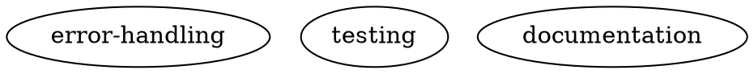

# PM Bootstrap Integration Specification

## Executive Summary

This specification outlines the integration of bootstrap functionality into the Product Manager (PM) agent, creating a unified project initialization experience. The bootstrap process will be implicit within the PM's interview workflow, eliminating the need for a separate bootstrap step.

## Architecture Overview

### Agent Responsibilities

```
PM Agent (READ-ONLY)
├── Conducts requirements interviews
├── Detects missing bootstrap components
├── Generates comprehensive specifications
└── Cannot modify files (security boundary)

Architect Agent (READ-ONLY)
├── Reviews specifications and code
├── Provides feedback and guidance
└── Cannot modify files (security boundary)

Coder Agents (READ-WRITE)
├── Implement ALL file changes
├── Execute bootstrap requirements
├── Initialize knowledge graph
└── Build and test implementations
```

### Key Principles

1. **Mandatory Containerization**: All agents access code through containers
2. **Read-Only PM/Architect**: Only coders can modify files
3. **Expertise-Aware**: Interview adapts to user's technical level
4. **Knowledge Graph First**: Documentation system initialized before other components
5. **Implicit Bootstrap**: Bootstrap requirements seamlessly integrated into specs

## Container Strategy

All development occurs within containers:

```
maestro-bootstrap:latest (Safe Container)
├── Ships with Maestro
├── Contains: docker-cli, git, gh, make, go, python, node
├── Used when no custom container exists
└── Fallback for bootstrap operations

Custom Project Container
├── Built from project's Dockerfile
├── Target for production development
└── Created by coder agents during bootstrap
```

## Expertise Levels

The PM adapts its interview based on user expertise:

### NON_TECHNICAL
- **Questions**: 3-4 basic (project name, purpose, repo URL)
- **Platform**: Auto-detected, no confirmation
- **Container**: Automatic selection
- **Bootstrap**: Fully automated

### BASIC (Default)
- **Questions**: 5-7 with confirmations
- **Platform**: Detected with confirmation
- **Container**: Automatic with explanation
- **Bootstrap**: Guided with clear descriptions

### EXPERT
- **Questions**: 8-10 detailed technical
- **Platform**: Full control over selection
- **Container**: Can specify custom Dockerfile
- **Bootstrap**: Explicit control over all aspects

## Bootstrap Requirements

The PM ensures these components are always included in specifications:

### 1. Knowledge Graph Initialization



### 2. Git Repository Setup
- Create git mirror at `.mirrors/`
- Configure target branch
- Set up branch naming patterns

### 3. Container Configuration
- Create/update Dockerfile
- Base image selection per platform
- Development dependencies

### 4. Build System (Makefile)
- Required targets: `build`, `test`, `lint`, `run`
- Platform-specific configurations
- CI/CD integration points

### 5. Project Structure
- `.gitignore` with platform-specific patterns
- `.gitattributes` for merge strategies
- `.editorconfig` for consistency
- Directory structure per platform conventions

## Implementation Components

### PM Workspace Without Repository

When no git repository exists, PM creates a minimal workspace:

```go
// pkg/workspace/pm.go
func EnsurePMWorkspace(ctx context.Context, projectDir string) (string, error) {
    if cfg.Git == nil || cfg.Git.RepoURL == "" {
        // Create minimal PM workspace for interview-only mode
        pmWorkspace := filepath.Join(projectDir, "pm-001")
        os.MkdirAll(pmWorkspace, 0755)
        return pmWorkspace, nil
    }
    // Existing clone logic...
}
```

### Bootstrap Detection

PM detects missing bootstrap components:

```go
type BootstrapRequirements struct {
    NeedsGitRepo        bool
    NeedsDockerfile     bool
    NeedsMakefile       bool
    NeedsKnowledgeGraph bool
    DetectedPlatform    string
    MissingComponents   []string
}
```

### Interview Flow Integration

Bootstrap questions integrate naturally into the interview:

```go
func (d *Driver) conductInterview(expertise string) {
    // Detect bootstrap requirements
    reqs := detectBootstrapRequirements()

    // Add questions based on expertise and requirements
    if reqs.NeedsGitRepo {
        addQuestion("What's your GitHub repository URL?")
    }

    // Generate spec with bootstrap prerequisites
    spec := generateSpecWithBootstrap(reqs, userResponses)
}
```

### Specification Generation

Bootstrap requirements appear as prerequisites in the specification:

```markdown
## Bootstrap Requirements

### 1. Initialize Documentation System
- Create `.maestro/` directory
- Initialize `.maestro/knowledge.dot` with default patterns

### 2. Git Repository Setup
- Create repository mirror at `.mirrors/`
- Configure target branch: main

### 3. Container Configuration
- Create Dockerfile for development
- Base image: golang:1.21-alpine

### 4. Build System
- Create Makefile with required targets
- Configure for Go module builds

## Project Requirements
[User's actual requirements begin here...]
```

## Repository Creation

Two approaches for handling non-existent repositories:

### Option A: Manual Creation (Initial Implementation)
- PM provides clear instructions
- User creates repository manually
- PM continues after confirmation

### Option B: Automated Creation (Future Enhancement)
- Custom PM tool using GitHub API
- Requires appropriate token permissions
- Creates repository programmatically

**Recommendation**: Start with Option A for simplicity.

## Migration Strategy

### Phase 1: CLI Preservation
- Keep legacy `maestro bootstrap` command temporarily
- Mark as deprecated in help text
- Remove before first release

### Phase 2: WebUI Integration
- WebUI exclusively uses new PM flow
- No legacy bootstrap option
- Seamless experience for new users

### Phase 3: Full Migration
- Remove CLI bootstrap entirely
- All initialization through PM
- Single, consistent workflow

## Success Metrics

1. **Zero Code Generation by PM**: PM remains strictly read-only
2. **Complete Bootstrap Coverage**: All bootstrap tasks explicit in specs
3. **Knowledge Graph Initialization**: Always created before other components
4. **Container Availability**: Every project has working container immediately
5. **Expertise Appropriateness**: Questions match user's technical level
6. **Single Workflow**: No separate bootstrap step required

## Error Handling

### Missing Repository
- **NON_TECHNICAL**: Step-by-step creation guide with screenshots
- **BASIC**: Clear instructions with example commands
- **EXPERT**: Brief note about missing repo

### Platform Detection Failure
- Default to generic platform
- Use safe bootstrap container
- Allow manual override in all expertise levels

### Container Build Failures
- Fallback to safe container
- Include debugging steps in spec
- Flag for architect review

## Security Considerations

1. **Read-Only Enforcement**: PM and Architect cannot modify files
2. **Container Isolation**: All code execution in containers
3. **Token Permissions**: Minimal GitHub token scopes required
4. **Secret Management**: No credentials in specifications

## Future Enhancements

1. **Automated Repository Creation**: GitHub API integration
2. **Platform Templates**: Pre-built configurations per platform
3. **Knowledge Graph Suggestions**: ML-based pattern recommendations
4. **Multi-Repository Support**: Handle complex project structures
5. **Migration Assistant**: Convert existing projects to Maestro

## Conclusion

This integration creates a seamless, secure, and intelligent project initialization experience. By merging bootstrap into the PM's natural workflow, we eliminate friction while maintaining clear security boundaries and role separation.

The approach prioritizes:
- **User Experience**: Single, intuitive workflow
- **Security**: Strict read/write boundaries
- **Flexibility**: Adapts to user expertise
- **Quality**: Knowledge graph ensures consistency
- **Maintainability**: Single codebase to maintain

## Related Documentation

- [Knowledge Graph Specification](wiki/DOCS_WIKI.md)
- [PM Agent Architecture](../pkg/pm/README.md)
- [Container Management](../pkg/exec/README.md)
- [Coder Workflow](CLAUDE.md)