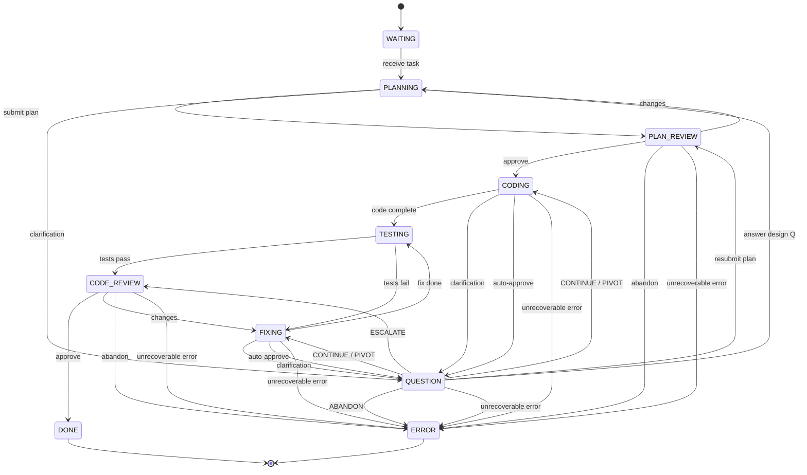

Here’s the complete current **STATES.md** content, inline for easy copy-paste:

---

# Coder Agent Finite-State Machine (Canonical)

*Last updated: 2025-07-06 (rev C)*

This document is the **single source of truth** for the coder agent’s workflow.
Any code, tests, or diagrams must match this specification exactly.

---

## Mermaid diagram

---

## State definitions

| State            | Purpose                                                                        |
| ---------------- | ------------------------------------------------------------------------------ |
| **WAITING**      | Agent is idle, waiting for the orchestrator to assign new work.                |
| **PLANNING**     | Draft a high-level implementation plan.                                        |
| **PLAN\_REVIEW** | Architect reviews the plan and either approves, requests changes, or abandons. |
| **CODING**       | Implement the approved plan.                                                   |
| **TESTING**      | Run the automated test suite.                                                  |
| **FIXING**       | Address test failures or review changes.                                       |
| **CODE\_REVIEW** | Architect reviews the code and either approves, requests changes, or abandons. |
| **QUESTION**     | Awaiting external clarification or approval.                                   |
| **DONE**         | Task fully approved and complete.                                              |
| **ERROR**        | Task abandoned or unrecoverable failure encountered.                           |

---

## Allowed transitions (tabular)

| From \ To        | WAITING | PLAN\_REVIEW | PLANNING | CODING | TESTING | FIXING | CODE\_REVIEW | QUESTION | DONE | ERROR |
| ---------------- | ------- | ------------ | -------- | ------ | ------- | ------ | ------------ | -------- | ---- | ----- |
| **WAITING**      | –       | –            | ✔︎       | –      | –       | –      | –            | –        | –    | –     |
| **PLANNING**     | –       | ✔︎           | –        | –      | –       | –      | –            | ✔︎       | –    | –     |
| **PLAN\_REVIEW** | –       | –            | ✔︎       | ✔︎     | –       | –      | –            | –        | –    | ✔︎    |
| **CODING**       | –       | –            | –        | –      | ✔︎      | –      | –            | ✔︎       | –    | ✔︎    |
| **TESTING**      | –       | –            | –        | –      | –       | ✔︎     | ✔︎           | –        | –    | –     |
| **FIXING**       | –       | –            | –        | –      | ✔︎      | –      | –            | ✔︎       | –    | ✔︎    |
| **CODE\_REVIEW** | –       | –            | –        | –      | –       | ✔︎     | –            | –        | ✔︎   | ✔︎    |
| **QUESTION**     | –       | ✔︎           | ✔︎       | ✔︎     | –       | ✔︎     | ✔︎           | –        | –    | ✔︎    |
| **DONE**         | –       | –            | –        | –      | –       | –      | –            | –        | –    | –     |
| **ERROR**        | –       | –            | –        | –      | –       | –      | –            | –        | –    | –     |

*(✔︎ = allowed, — = invalid)*

---

## AUTO\_CHECKIN & deterministic budget overflow

1. **Optional question:** While in `CODING` or `FIXING`, the LLM may voluntarily ask for clarification and transition to `QUESTION`.
2. **Deterministic question (auto-approve):** Each long-running loop has an iteration budget (`coding_iterations`, `fixing_iterations`). When exhausted, the agent **must** transition to `QUESTION` requesting one of:
   • **CONTINUE** (same plan)
   • **PIVOT** (small plan change)
   • **ESCALATE** (send to `CODE_REVIEW`)
   • **ABANDON** (abort task)

Upon receiving an answer:

| Answer               | Next state                                                                |
| -------------------- | ------------------------------------------------------------------------- |
| **CONTINUE / PIVOT** | Return to the originating state (`CODING` or `FIXING`) and reset counter. |
| **ESCALATE**         | Move to `CODE_REVIEW`.                                                    |
| **ABANDON**          | Move to `ERROR`.                                                          |

---

## Error handling

* The agent enters **ERROR** when:

  1. It receives **ABANDON** from `PLAN_REVIEW`, `CODE_REVIEW`, or `QUESTION`.
  2. An **auto-approve** request is rejected with ABANDON.
  3. Any unrecoverable runtime error occurs (panic, out-of-retries, etc.).
* **ERROR** is terminal; orchestrator decides next steps.

---

*Any deviation from this document is a bug.*

