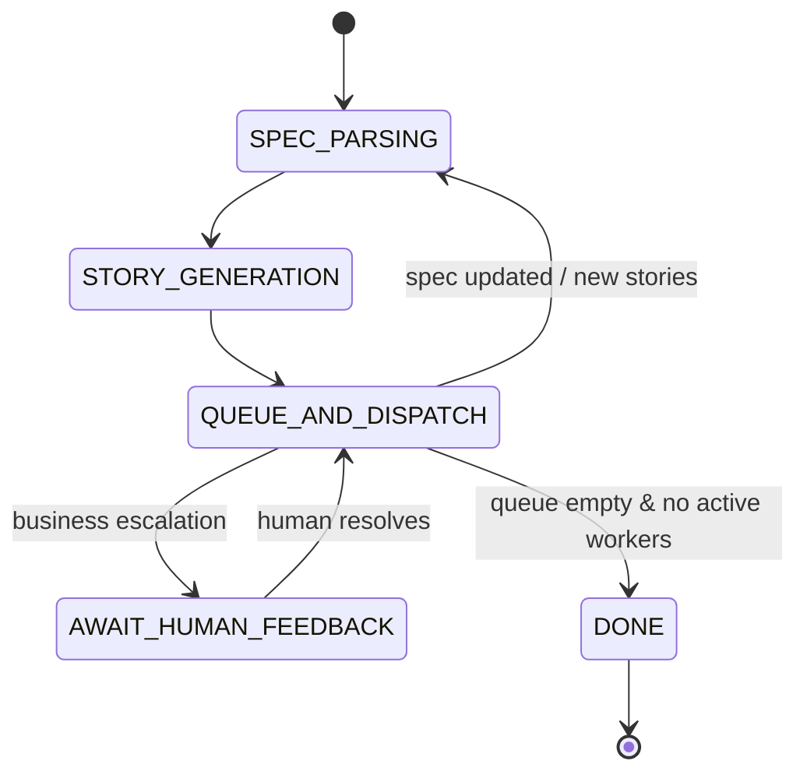

# Master State Diagrams (v2)

Below are the **canonical finite‑state machines** for both the **Coding Agent** and the **Architect Agent** after the latest design changes (merged queue/dispatch, unified QUESTION state, channel‑based workers).  Keep this file as the single source of truth for future story writing and onboarding.

---

## Coding Agent FSM

```mermaid
stateDiagram-v2
    [*] --> WAITING
    WAITING --> PLANNING: receive TASK
    PLANNING --> QUESTION: needs clarification
    QUESTION --> PLANNING: answer received
    PLANNING --> PLAN_REVIEW: draft plan ready
    PLAN_REVIEW --> PLANNING: architect requests change
    PLAN_REVIEW --> CODING: plan approved

    CODING --> QUESTION: tech question
    QUESTION --> CODING: answer received

    CODING --> TESTING: code generated
    TESTING --> CODE_REVIEW: tests pass
    TESTING --> FIXING: tests fail

    FIXING --> CODING: fixes applied

    CODE_REVIEW --> FIXING: architect requests change
    CODE_REVIEW --> DONE: architect approves

    DONE --> [*]
    state QUESTION {
        [*] --> WAITING_ANSWER
        WAITING_ANSWER --> ANSWER_RECEIVED
        note right: origin metadata tracks return state
    }
```

*Tool calls (`<tool name="shell">…`) occur inside **PLANNING**, **CODING**, and **FIXING** states — they do **not** cause state transitions.*

---

## Architect Agent FSM (merged queue/dispatch)



### Internal channels (not states)

```text
readyStoryCh        ← queue marks story ready (buffered 1)
idleAgentCh         ← dispatcher notes agent free (buffered 1)
reviewDoneCh        ← review worker finished (buffered 1)
questionAnsweredCh  ← answer worker finished (buffered 1)
```

Workers (goroutines):

* **ANSWER\_WORKER** — long-running, handles QUESTION messages using o3 and pushes to `questionAnsweredCh`.
* **REVIEW\_WORKER** — long-running, runs automated checks and pushes to `reviewDoneCh`.

The main driver **selects** on these channels while in `QUEUE_AND_DISPATCH`. Workers are created once at driver start and run until context cancellation.

---

> **Last updated:** 2025‑06‑13 (Phase 6 completion)

