# Maestro Bootstrap System Implementation Plan  
*Generated 2025-07-28 21:35 UTC*

---

## 1  Objectives
* Detect broken or incomplete project infrastructure during `maestro init`.
* Auto‑generate **bootstrap specs** that flow through the normal Architect → Coder pipeline.
* Ensure each platform (Go, Node, Python, …) reaches a **clean baseline**: builds, tests, lints, container image, and binary‑size rules all pass.
* Block new feature work until bootstrap is verified complete.

---

## 2  High‑Level Workflow

```mermaid
graph TD
    A[Init Command] --> B[Workspace Verification]
    B -->|Pass| Z[Init Complete]
    B -->|Fail| C{{Bucket failures<br>per‑platform}}
    C --> D[Generate Platform Specs]
    D --> E[Sequential Bootstrap Queue]
    E --> F[Architect splits specs<br>into atomic stories]
    F --> G[One Coding Agent<br>⇢ Worktree ⇢ PR ⇢ Merge]
    G --> H{{All Platform<br>Verifications Pass?}}
    H -->|Yes| I[Mark bootstrap_complete = true]
    H -->|No| F
    I --> Z
```



* **Single coding agent** active during bootstrap ⇒ avoids merge storms.  
* Stories merge **sequentially**; orchestrator releases next story only after CI + merge of previous.

---

## 3  Platform Detection & Spec Generation

| Signal | Platform Tag |
|--------|--------------|
| `go.mod` | `go` |
| `package.json` | `node` |
| `pyproject.toml` / `requirements.txt` | `python` |
| none of the above | `generic` |

1. **One root spec per detected platform** (`bootstrap-go‑<date>`, `bootstrap-node‑…`, …).  
2. Architect injects cross‑spec dependencies if build pipelines intersect (e.g., Go tests depend on JS assets).  
3. Each spec rendered from a `.tpl.md` with variables:
   * `platform_build_default`, `platform_test_default`, `platform_lint_default`
   * List of failing verification checks
   * Container image to repair/build.

---

## 4  Container Strategy

| Scenario | Action |
|----------|--------|
| **Single platform** | Use standard dev image (e.g., `golang:1.24-alpine`). |
| **Multi‑platform & pipelines tied together** | Generate **polyglot `Dockerfile.bootstrap`** installing all tool‑chains. |
| **Multi‑platform but independent dirs** | Keep per‑platform images; stories tagged with `image` key. |

**Container Validation Steps**

1. `validateDockerImage()` – pull image, run `sh -c "echo ok"`.
2. If pull/build fails ⇒ add repair steps to the platform’s bootstrap spec.
3. Run first build with `--network=none` and rootless mode; re‑enable net only if explicitly required.

---

## 5  PR Merge Policy During Bootstrap

* Orchestrator flag `bootstrap.parallel = false` (default).  
* Only one coding agent and one open PR at a time.  
* Label all bootstrap PRs with `bootstrap-YYYYMMDD` for easy GitHub filtering.  
* Upon successful merge, orchestrator enqueues the **next** bootstrap story.

---

## 6  Workspace Verification Extensions

### 6.1  Binary‑Size Checker
* **Hard fail** if any new file ≥ 100 MB (GitHub push limit).
* **Warn** 50–99 MB; recommend Git LFS.
* Implemented in `binary_size_checker.go`.

### 6.2  Container Validation
* `container_validator.go` adds above checks to verification phase.

---

## 7  Story Lifecycle

1. **Coder** clones fresh worktree ⇒ `/workspace`.
2. Runs pre‑commit hooks (build, test, lint) inside dev container.
3. Generates commit & PR.
4. Waits for Architect review + CI.
5. Architect merges; coder terminates; worktree deleted.

---

## 8  Queue & Dependency Management

* Architect tags every non‑bootstrap spec `blocked_by: bootstrap-root`.
* Orchestrator ignores non‑bootstrap specs until `bootstrap_complete == true`.
* Cross‑platform dependencies captured via `blocked_by` fields across bootstrap specs.

---

## 9  Large Binary & Asset Policy

| Rule | Enforcement |
|------|-------------|
| ≥ 100 MB | Verification **fails**. |
| 50 – 99 MB | Warning; prefer Git LFS. |
| LFS audit | Terminal story runs `git lfs fsck --pointers`. |

---

## 10  Incremental Lint Adoption

| Phase | Action |
|-------|--------|
| **0 – Mechanical** | Auto‑format, add `//nolint(maestro-todo)` suppressions. |
| **1 – Semantic** | Architect emits follow‑up stories to remove suppressions after bootstrap passes. |
| Gate | Pre‑commit fails only on *new* unsuppressed warnings. |

---

## 11  Terminal Verification Story

* Runs full verification suite.  
* Fails pipeline if any check fails.  
* **Optional**: generates `verification_report.json` and uploads via CI artefacts.

---

## 12  Config File Additions

```jsonc
{{
  "bootstrap": {{
    "completed": false,
    "last_run": "0001-01-01T00:00:00Z",
    "template_revisions": {{
      "go": "go@a1b2c3d4",
      "node": "node@f5e6b7c8"
    }}
  }},
  "metrics": {{
    "bootstrap_runs": []
  }}
}}
```

---

## 13  Minimal Telemetry

| Metric | When Logged |
|--------|-------------|
| `bootstrap_story_duration_seconds` | After each story finishes. |
| `bootstrap_verification_failures_total` | Each failed verification pass. |

Simple SQLite table (`metrics (spec_id, story_id, success, duration_s, ts)`).

---

## 14  Implementation Phases

**Current System Analysis:**
✅ Verification system solid (`pkg/workspace/verify.go`) - detects Makefile targets, build issues  
✅ Platform detection working (`pkg/bootstrap/platforms.go`) - comprehensive platform support  
✅ Orchestrator integration ready (`cmd/orchestrator/main.go`) - proper init command flow  
✅ Bootstrap infrastructure exists - SQLite integration, story generation implemented  

| Phase | Key Tasks | Status | Implementation Notes |
|-------|-----------|--------|---------------------|
| **1** | `binary_size_checker.go`, `container_validator.go` extensions to `pkg/workspace/` | **✅ COMPLETE** | Successfully integrated - binary size limits enforced, container validation working |
| **2** | Extend verification to return structured failure data for bootstrap specs | **✅ COMPLETE** | BootstrapFailure struct with categorized failures, priority ordering, and structured details |
| **3** | Bootstrap template system in `pkg/templates/bootstrap/` with platform `.tpl.md` files | **✅ COMPLETE** | Comprehensive bootstrap spec generation with platform-specific guidance and actionable remediation steps |
| **3.5** | Go-specific bootstrap template with version detection, container upgrade, and tooling setup | **✅ COMPLETE** | Go template with go mod init, version detection, golangci-lint config, pre-commit hooks, and container upgrade logic |
| **3.6** | Enhanced Go template with advanced features and container selection refinements | **✅ COMPLETE** | Added go.work support, GOPRIVATE, CGO detection, git hooks installer, CI stub, improved container logic, updated config schema for new container format with name/from fields |
| **3.7** | Dockerfile discovery and tri-state container validation | **✅ COMPLETE** | Added dockerfile scanning UI, tri-state validation (PASS/NEED_BOOTSTRAP/CONFIG_ERROR), fixed container validation for dockerfile mode |
| **3.8** | Template refinements for dockerfile workflow | **✅ COMPLETE** | Updated template with explicit dockerfile copy instructions, proper container building workflow, consolidated duplicate sections |
| **4** | Git branch verification and update_container MCP tool | **🔄 IN PROGRESS** | Adding git branch existence checks, creating MCP tool for container updates with Docker socket access |
| **5** | End-to-end agent testing | **PENDING** | Test complete workflow: init → bootstrap spec → agent builds dockerfile → container update → validation passes |
| **6** | Multi-platform detection support in existing `pkg/bootstrap/platforms.go` | **READY** | Extend current platform detection, update config schema |
| **7** | Config system bootstrap tracking - completion status, template revisions | **READY** | Integrate with existing `pkg/config/` system |
| **8** | Wire bootstrap spec generation into init command, orchestrator queue blocking | **READY** | Integration with existing orchestrator flow |

---
## 15  Recent Achievements (Phase 3.7-3.8)

### Dockerfile Discovery and Container Validation (Phase 3.7)

**Tri-State Container Validation**:
- `ValidationPass` - Container ready to use
- `ValidationNeedBootstrap` - Bootstrap required for detect/dockerfile modes  
- `ValidationConfigError` - User configuration errors
- `ValidationTransientError` - Network/registry issues

**Dockerfile Discovery System**:
- Interactive dockerfile selection with priority ordering (`.maestro/Dockerfile` highest)
- Persistent worktree management for both platform detection and dockerfile scanning
- Updated container configuration schema with `Name` and `From` fields
- Bootstrap container changed from `docker:dind-alpine` to `ubuntu:22.04` + Docker socket mount

**Key Fixes**:
- Container validation properly detects dockerfile mode vs missing configuration
- Empty container name triggers bootstrap instead of configuration error
- Template data flow preserves empty container image for dockerfile detection

### Template Refinements (Phase 3.8)

**Dockerfile Workflow Instructions**:
- Explicit copy step: `cp Dockerfile .maestro/Dockerfile && docker build...`
- Clear separation of worktree-level vs project-level `.maestro` directories
- Updated `modify_config` messaging to clarify it sets final tag name
- Consolidated duplicate container configuration sections
- No base image assumptions - respects dockerfile author's choices

**Template Structure**:
- Priority 1 container building section for dockerfile mode
- Conditional rendering based on container image presence
- Integrated container requirements into Technical Notes section
- Clear distinction between dockerfile build mode and image upgrade mode

---
## 16  Current Work (Phase 4)

### Git Branch Verification
**Problem**: Config specifies target branch that may not exist in repository
**Solution**: Add branch existence check to workspace verification
**Bootstrap Action**: Template includes branch creation and initial push if missing

### update_container MCP Tool
**Architecture**: Coder agents run on host, manage persistent Docker containers per story
**Tool Requirements**:
1. Build container from `.maestro/Dockerfile` (Docker socket access required)
2. Update project-level config with new container name
3. Stop current development container
4. Update executor image setting for future container starts

**Container Access**: All coder development containers require Docker socket mount for self-updating capability

### Codebase Cleanup
**Legacy Naming**: Remove "LongRunning" prefixes throughout `pkg/exec/` - no longer accurate
**Config Updates**: Update `getDockerImageForAgent()` for new container configuration schema

---
## 17  Bootstrap Template Enhancements (Phase 3.6)

### Container Selection Logic

**Priority Flow for Bootstrap**:
1. **Container verification failed** (needs bootstrap):
   - User specified non-default standard image → use as-is
   - User specified custom dockerfile that won't build → upgrade to suitable build container
   - User specified "default" → detect Go version and validate container exists
   - Coder updates project config via `modify_config` tool when complete

2. **Container verification succeeded**: Use existing container from config

**Go Version Detection Priority**:
1. `go.mod` file `go X.Y` directive (highest priority)
2. Project config `go_version` field  
3. Internet detection via `curl -s 'https://go.dev/dl/?mode=json' | jq -r '[.[] | select(.stable)][0].version'`

**Container Validation**:
- Verify container exists: `curl -fs "https://registry.hub.docker.com/v2/repositories/library/golang/tags/${VERSION}-alpine"`
- LLM fallback to earlier versions if latest doesn't exist
- Prefer alpine unless requirements need more robust base

### Config Schema Clarity

**Updated Container Configuration** (Phase 3.7):
```jsonc
"container": {
  "name": "maestro-hello-dev",           // Final tagged container name (empty for dockerfile mode until built)
  "from": {
    "dockerfile": "Dockerfile",          // Custom dockerfile path
    "container": "ubuntu:22.04"          // Bootstrap container for building (not docker:dind-alpine)
  },
  "last_built": "2024-01-01T00:00:00Z",
  "needs_rebuild": true
}
```

### Enhanced Go Template Features

**Multi-Module Support**:
- Detect `go.work` files and include `go work sync` commands
- Handle workspace-level dependency management

**Private Module Support**:
```bash
export GOPRIVATE=github.com/myorg/*
go env -w GOPRIVATE=$GOPRIVATE
```

**CGO Detection**:
- Scan for `import "C"` in Go files
- Upgrade from alpine to glibc-based image if CGO detected
- Install `build-base` in alpine if keeping alpine variant

**Git Hooks Integration**:
- Generate `.git/hooks/pre-commit` script
- Add `make install-githooks` target to install hooks in CI
- Ensure hooks are executable and properly configured

**CI Pipeline Stub**:
- Generate minimal `.github/workflows/ci.yml` 
- Include standard `make test`, `make lint`, `make build` workflow
- Integrate with existing team CI patterns

**Module Initialization**:
- Use git repository URL for `go mod init` (Go standard practice)
- Extract module name from project git config: `go mod init <git-repo-url>`

**Makefile Preservation**:
- Preserve existing non-Go targets (tailwind, npm, python, etc.)
- Only add/modify Go-specific targets (`build`, `test`, `lint`)
- Multi-platform configuration safety

**Dockerfile Separation**:
- Development container: `.maestro/dockerfile` or `dockerfile-maestro`
- Keep separate from deployment `Dockerfile`
- Inherit relevant packages/env vars from existing dockerfile

### Architect Integration Hints

**Story Prioritization**:
- Bootstrap specs include clear priority indicators for container stories
- Architect should prioritize container setup as first story in bootstrap sequence
- Template provides explicit guidance: "Container setup must complete before other bootstrap tasks"

**Database Storage**:
- Generated specs stored in database `specs` table, not filesystem
- Maintains clean workspace while enabling debugging and replay
- Specs flow through normal dispatcher channels

---
## 15  Config Flags

| Flag | Default | Description |
|------|---------|-------------|
| `bootstrap.parallel` | `false` | Run multiple coding agents / stacked PRs if `true`. |
| `bootstrap.large_file_warn_mb` | `50` | Soft warning threshold. |
| `bootstrap.large_file_block_mb` | `100` | Hard fail threshold. |
| `bootstrap.docker.polyglot` | `auto` | `auto` / `single` / `per‑platform`. |

---

*End of document*
