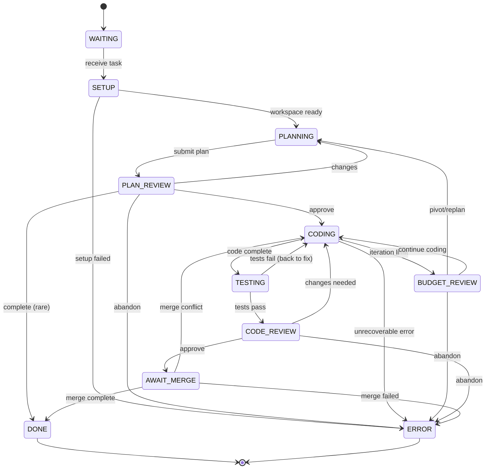

# Coder Agent Finite-State Machine (Canonical)

*Last updated: 2025-01-20 (rev D) - Effects Pattern Implementation*

This document is the **single source of truth** for the coder agent's workflow.
Any code, tests, or diagrams must match this specification exactly.

---

## Mermaid diagram

---

## State definitions

| State              | Purpose                                                                          |
| ------------------ | -------------------------------------------------------------------------------- |
| **WAITING**        | Agent is idle, waiting for the orchestrator to assign new work.                 |
| **SETUP**          | Initialize workspace, branch, and development environment.                      |
| **PLANNING**       | Draft a high-level implementation plan using LLM and available tools.           |
| **PLAN\_REVIEW**   | Architect reviews the plan and either approves, requests changes, or abandons.  |
| **CODING**         | Implement the approved plan using MCP tools for file operations.                |
| **TESTING**        | Run automated test suite and formatting checks.                                 |
| **BUDGET\_REVIEW** | Request continuation when iteration limits are reached (budget management).     |
| **CODE\_REVIEW**   | Architect reviews the code and either approves, requests changes, or abandons.  |
| **AWAIT\_MERGE**   | Wait for PR merge completion, handle merge conflicts if needed.                 |
| **DONE**           | Task fully approved and merged successfully.                                    |
| **ERROR**          | Task abandoned or unrecoverable failure encountered.                            |

---

## Allowed transitions (tabular)

| From \ To          | WAITING | SETUP | PLANNING | PLAN_REVIEW | CODING | TESTING | BUDGET_REVIEW | CODE_REVIEW | AWAIT_MERGE | DONE | ERROR |
| ------------------ | ------- | ----- | -------- | ----------- | ------ | ------- | ------------- | ----------- | ----------- | ---- | ----- |
| **WAITING**        | –       | ✔︎    | –        | –           | –      | –       | –             | –           | –           | –    | ✔︎    |
| **SETUP**          | –       | –     | ✔︎       | –           | –      | –       | –             | –           | –           | –    | ✔︎    |
| **PLANNING**       | –       | –     | –        | ✔︎          | –      | –       | –             | –           | –           | –    | –     |
| **PLAN\_REVIEW**   | –       | –     | ✔︎       | –           | ✔︎     | –       | –             | –           | –           | ✔︎   | ✔︎    |
| **CODING**         | –       | –     | –        | –           | –      | ✔︎      | ✔︎            | –           | –           | –    | ✔︎    |
| **TESTING**        | –       | –     | –        | –           | ✔︎     | –       | –             | ✔︎          | –           | –    | –     |
| **BUDGET\_REVIEW** | –       | –     | ✔︎       | –           | ✔︎     | –       | –             | –           | –           | –    | ✔︎    |
| **CODE\_REVIEW**   | –       | –     | –        | –           | ✔︎     | –       | –             | –           | ✔︎          | –    | ✔︎    |
| **AWAIT\_MERGE**   | –       | –     | –        | –           | ✔︎     | –       | –             | –           | –           | ✔︎   | ✔︎    |
| **DONE**           | –       | –     | –        | –           | –      | –       | –             | –           | –           | –    | –     |
| **ERROR**          | –       | –     | –        | –           | –      | –       | –             | –           | –           | –    | –     |

*(✔︎ = allowed, — = invalid)*

---

## Budget management & iteration control

**Budget Review System**: Long-running loops have iteration budgets to prevent infinite loops:

- **coding_iterations**: Limits coding attempts before requiring review
- **planning_iterations**: Limits planning attempts before escalation

When budget is exhausted, agent transitions to **BUDGET_REVIEW** and requests:
- **CONTINUE**: Continue with current approach
- **PIVOT**: Small plan change and continue  
- **REPLAN**: Return to PLANNING with new approach
- **ABANDON**: Abort task

---

## Error handling

The agent enters **ERROR** when:

1. Setup fails (workspace, permissions, dependencies)
2. Architect responds with **ABANDON** from any review state
3. Budget review is rejected with **ABANDON**  
4. Unrecoverable runtime errors (panic, network failure, etc.)
5. Merge process fails permanently

**ERROR** is terminal; orchestrator decides recovery steps.

---

## Effects Pattern Integration

The coder agent uses the **Effects Pattern** for async operations:

- **Message sending** (to architect, dispatcher) 
- **Tool invocations** (MCP file operations)
- **External service calls** (git, build tools)

All async operations are represented as Effect objects that are executed by the runtime, providing clean separation of state logic from side effects.

---

*Any deviation from this document is a bug.*

