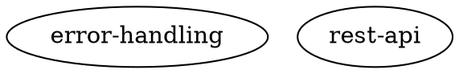

# Maestro Knowledge Graph

## Overview

The Knowledge Graph is a system that helps Maestro agents maintain consistency and quality by capturing architectural patterns, design decisions, and coding conventions in a structured, queryable format. Think of it as the project's "institutional memory" that grows and evolves as the codebase develops.

## The Problem

Without a knowledge graph, AI coding agents face several challenges:

- **Inconsistent code**: Each agent starts from scratch, leading to varied implementation styles
- **Architectural drift**: Agents may not follow established patterns or make conflicting design decisions
- **Repeated mistakes**: Lessons learned from previous stories aren't retained
- **Excessive review cycles**: Architects must repeatedly explain the same patterns and rules
- **Context limitations**: Agents can't see the "big picture" of architectural decisions

## The Solution

The Knowledge Graph provides:

1. **Persistent Memory**: Architectural patterns and rules that persist across stories
2. **Contextual Guidance**: Agents receive relevant patterns when planning work
3. **Validation**: Automated checking that code aligns with established patterns
4. **Evolution**: The graph grows organically as the project matures

## How It Works

### Storage Format

The knowledge graph is stored as a `.maestro/knowledge.dot` file in your repository using the DOT graph format:



This format is:
- **Human-readable**: Easy to review in pull requests
- **Git-friendly**: Shows clear diffs when patterns change
- **Structured**: Machines can parse and query it efficiently

### Node Types

The graph contains different types of knowledge nodes:

- **pattern**: Implementation patterns (e.g., error handling, logging)
- **rule**: Constraints that must be followed (e.g., API standards, security requirements)
- **component**: System components and their responsibilities
- **interface**: Integration points and contracts
- **abstraction**: High-level architectural concepts
- **datastore**: Database schemas and data models
- **external**: Third-party dependencies and APIs

### Levels

Knowledge operates at two levels:

- **architecture**: High-level design decisions and system structure
- **implementation**: Code-level patterns and conventions

### Workflow Integration

#### 1. Architect Scoping
When creating stories, the architect reviews **architecture-level** patterns to ensure new work aligns with existing system design.

#### 2. Coder Planning
When a coder starts a story, Maestro automatically:
1. Extracts key terms from the story description
2. Searches the knowledge graph for relevant patterns
3. Builds a "knowledge pack" with 20-30 related nodes
4. Provides this context to the coder during planning

#### 3. Code Review
The architect reviews:
- Whether the implementation follows patterns in the knowledge pack
- If the coder updated the knowledge graph with new discoveries
- That any graph changes are valid and align with architecture

#### 4. Evolution
After merge, the knowledge graph is updated for future stories. New patterns discovered become part of the institutional memory.

## Example Scenario

**Story**: "Add user authentication to the API"

**What Happens**:

1. **Planning**: The coder receives a knowledge pack containing:
   - "rest-api" rule (OpenAPI 3.0 standard)
   - "error-handling" pattern (errors.Wrap usage)
   - "security-headers" pattern (required security headers)
   - "jwt-tokens" pattern (token format and validation)

2. **Coding**: The coder implements authentication following these patterns

3. **Discovery**: The coder adds a new node to the knowledge graph:
   ```dot
   "oauth2-flow" [
       type="pattern"
       level="implementation"
       status="current"
       description="Use OAuth2 authorization code flow with PKCE"
       example="See pkg/auth/oauth2.go for reference implementation"
   ];
   ```

4. **Review**: The architect validates:
   - Implementation matches the received patterns
   - New "oauth2-flow" pattern is correctly documented
   - Pattern aligns with existing security architecture

5. **Future**: Next story about authentication automatically receives the "oauth2-flow" pattern in its knowledge pack

## Benefits

### For Coders
- **Guidance**: Clear patterns to follow from day one
- **Consistency**: Avoid reimplementing solved problems
- **Context**: Understand "why" decisions were made

### For Architects
- **Efficiency**: Fewer review cycles explaining the same patterns
- **Scale**: Knowledge doesn't bottleneck on architect availability
- **Evolution**: Easy to track how architecture evolves over time

### For Projects
- **Quality**: Consistent code across all stories
- **Velocity**: Less time in review, more time shipping
- **Maintainability**: New contributors understand patterns quickly
- **Documentation**: Living documentation that stays in sync with code

## Best Practices

### What to Add
- ✅ Architectural decisions and their rationale
- ✅ Implementation patterns used across multiple files
- ✅ Critical rules that must never be violated
- ✅ Integration patterns with external systems
- ✅ Common pitfalls and how to avoid them

### What to Avoid
- ❌ Low-level implementation details that change frequently
- ❌ Temporary workarounds or tech debt (unless tracking deprecation)
- ❌ Obvious language conventions (e.g., "use semicolons in JavaScript")
- ❌ Project-specific trivia that doesn't guide implementation

### When to Update
- **During Planning**: Add nodes for new patterns you plan to introduce
- **During Coding**: Document discoveries that would help future stories
- **During Review**: Refine descriptions based on architect feedback
- **After Merge**: Mark deprecated patterns when better alternatives emerge

## Technical Details

### Storage
- **Location**: `<repoRoot>/.maestro/knowledge.dot` (git-committed)
- **Index**: SQLite database for fast searching (ephemeral, auto-rebuilt)
- **Format**: DOT graph format (part of Graphviz suite)

### Search
- Full-text search using SQLite FTS5
- Frequency-based term extraction from story descriptions
- Includes neighboring nodes for context (one hop in the graph)

### Validation
- Schema validation ensures required fields are present
- Enum validation checks node types, levels, and statuses
- Edge validation ensures referenced nodes exist
- Format validation happens at code review time

### Performance
- Knowledge packs are cached per story for efficiency
- Index rebuilds in <1 second for graphs with 1000+ nodes
- Search and retrieval typically completes in <100ms

## Future Enhancements

The knowledge graph system is designed to evolve:

- **Pattern Learning**: Automatically suggest patterns based on successful reviews
- **Visualization**: Generate interactive graphs for human exploration
- **Cross-Project Learning**: Share common patterns across related projects
- **Technical Debt Tracking**: Use deprecated→current transitions for migration planning
- **Semantic Search**: More intelligent term extraction and matching

## Getting Started

The knowledge graph is automatically initialized when you create a new Maestro project. A default graph with common patterns is included to get you started.

As your project grows, the knowledge graph grows with it—capturing the collective wisdom of your team and AI agents working together.

---

**Related Documentation**:
- [Knowledge Graph Implementation Spec](DOC_GRAPH.md) - Detailed technical specification
- [Architect Agent](ARCHITECT_READ_ACCESS_SPEC.md) - How architects use the knowledge graph
- [Coder Workflow](../CLAUDE.md) - How coders integrate with the knowledge system
