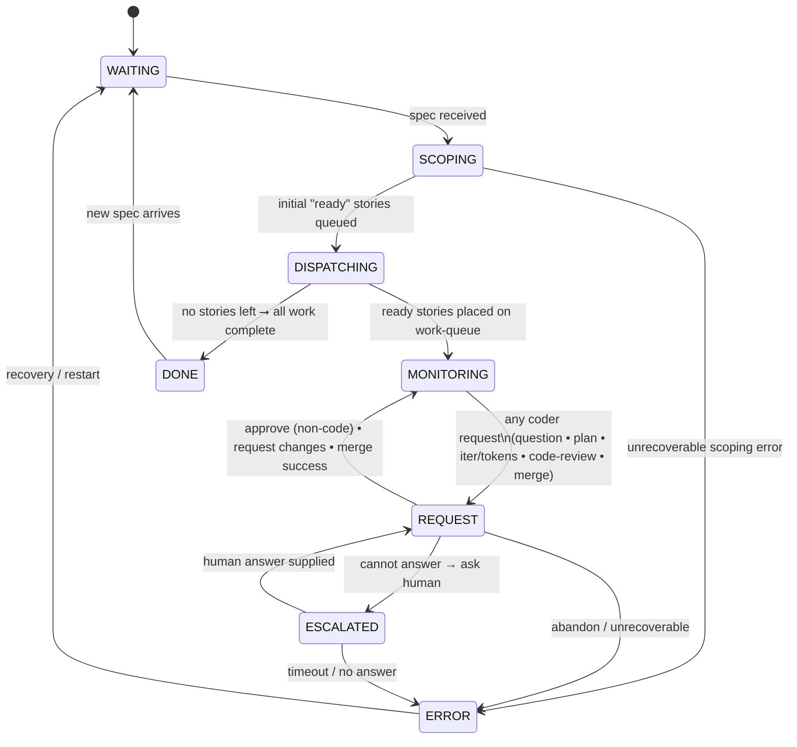

# Architect Agent Finite-State Machine (Canonical)

*Last updated: 2025-07-13 (rev D - Merge Workflow)*

This document is the **single source of truth** for the architect agent's workflow.
Any code, tests, or diagrams must match this specification exactly.

---

## Mermaid diagram

---

## State definitions

| State            | Purpose                                                                        |
| ---------------- | ------------------------------------------------------------------------------ |
| **WAITING**      | Agent is idle, waiting for specification files to process.                    |
| **SCOPING**      | Parse specification and generate story files with dependencies.               |
| **DISPATCHING**  | Load stories, check dependencies, and assign ready stories to coder agents.   |
| **MONITORING**   | Monitor coder progress and wait for requests (questions, reviews, merges).    |
| **REQUEST**      | Process coder requests: questions, plan/code reviews, merge operations.       |
| **ESCALATED**    | Waiting for human intervention on complex business questions.                 |
| **DONE**         | All stories completed successfully.                                           |
| **ERROR**        | Unrecoverable error or workflow abandonment.                                  |

---

## Key workflow changes (Merge Workflow)

- **MERGING state removed**: Merge operations now handled directly in REQUEST state
- **Merge requests**: Coders send `REQUEST(type=merge)` after code approval  
- **Story completion**: Only happens after successful PR merge (not code approval)
- **Dependency unlocking**: Triggered by merge success, enabling dependent stories
- **Conflict handling**: Merge conflicts returned to coder for resolution via FIXING state

---

*Any deviation from this document is a bug.*

