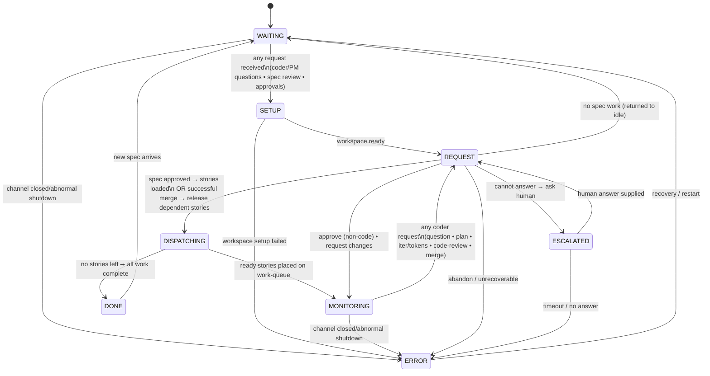

# Architect Agent Finite-State Machine (Canonical)

*Last updated: 2025-12-20 (rev I - SETUP state added for deferred workspace cloning)*

This document is the **single source of truth** for the architect agent's workflow.
Any code, tests, or diagrams must match this specification exactly.

---

## Mermaid diagram

---

## State definitions

| State            | Purpose                                                                        |
| ---------------- | ------------------------------------------------------------------------------ |
| **WAITING**      | Agent is idle, waiting for requests (spec reviews, questions, approvals).     |
| **SETUP**        | Ensure workspace is cloned/updated from git mirror before processing work.    |
| **DISPATCHING**  | Load stories, check dependencies, and assign ready stories to coder agents.   |
| **MONITORING**   | Monitor coder progress and wait for requests (questions, reviews, merges).    |
| **REQUEST**      | Process ALL requests: spec reviews, coder questions/reviews/merges.           |
| **ESCALATED**    | Waiting for human intervention on complex business questions.                 |
| **DONE**         | All stories completed successfully.                                           |
| **ERROR**        | Unrecoverable error or workflow abandonment.                                  |

---

## Key workflow patterns

### Merge Workflow

- **Merge requests**: Coders send merge requests after code approval via REQUEST state
- **Story completion**: Only happens after successful PR merge (not code approval)
- **Dependency unlocking**: Triggered by merge success, enabling dependent stories
- **Conflict handling**: Merge conflicts returned to coder for resolution
- **Post-merge transition**: Successful merges transition from REQUEST → DISPATCHING to release dependent stories and update mirrors (not REQUEST → MONITORING)

### PM Spec Review Workflow

- **Spec review requests**: PM sends REQUEST(type=spec) after conducting interview and validating spec
- **Review process**: Architect reviews spec in REQUEST state using review tools:
  - `spec_feedback` - Send feedback/questions to PM (status: NEEDS_CHANGES)
  - `submit_stories` - Approve spec and generate stories (status: APPROVED)
- **Iterative review**: PM can resubmit improved spec after addressing feedback
- **Approval outcome**: When architect calls `submit_stories`:
  - Stories are generated from requirements
  - Stories are loaded into queue with dependencies
  - Container validation ensures DevOps stories are prioritized
  - RESPONSE(approved=true) sent to PM
  - Architect transitions to DISPATCHING to assign stories to coders

### REQUEST State Handling

The REQUEST state processes different types of approval requests based on `ApprovalType`:

- **ApprovalTypePlan**: Coder plan approval (auto-approved, stored in database)
- **ApprovalTypeCode**: Iterative code review with read tools (approve/request changes)
- **ApprovalTypeCompletion**: Story completion approval (approve/request changes)
- **ApprovalTypeBudgetReview**: Token/iteration budget increase requests
- **ApprovalTypeSpec**: PM spec review with story generation tools (spec_feedback, submit_stories)

Each type uses appropriate review logic and tools for its domain.

---

## Error handling

* The agent enters **ERROR** when:

  1. It receives **ABANDON** from escalation or unrecoverable runtime errors.
  2. Any unrecoverable runtime error occurs (panic, out-of-retries, etc.).
  3. **SUSPEND** state times out waiting for service recovery.

* **ERROR** is terminal until recovery/restart by orchestrator.

---

## SUSPEND state (service unavailability)

The **SUSPEND** state handles external service unavailability (LLM API timeouts, network failures). This is a base-level state available to all agents.

### Entry conditions
* Agent enters **SUSPEND** when the retry middleware exhausts all retries on a retryable error (network timeout, API unavailable)
* The `ErrorTypeServiceUnavailable` error signals the agent to call `EnterSuspend()`
* SUSPEND can be entered from any non-terminal state (not from DONE, ERROR, or SUSPEND itself)

### Behavior in SUSPEND
* Agent preserves all state data (no data loss)
* Agent stores originating state in `KeySuspendedFrom` state data
* Agent blocks on restore channel waiting for orchestrator signal
* Orchestrator polls all configured APIs (LLM providers, GitHub) every 30 seconds
* When ALL APIs are healthy, orchestrator broadcasts restore signal

### Exit conditions
* **Restore signal**: Agent returns to originating state with all data preserved
* **Timeout (15 min default)**: Agent transitions to **ERROR** for full recycle
* **Context cancellation**: Agent transitions to **ERROR** (shutdown)

### Key design points
* SUSPEND preserves in-flight work - no need to restart from beginning
* Uses separate `KeySuspendedFrom` key to track originating state
* All APIs must pass health check for restore (no partial recovery)
* ERROR is "the ultimate recycler" - provides clean restart if SUSPEND times out

## Shutdown handling

* The agent enters **DONE** when:

  1. All stories are completed successfully (normal completion via DISPATCHING state).

* The agent enters **ERROR** when:

  1. It receives **ABANDON** from escalation or unrecoverable runtime errors.
  2. Any unrecoverable runtime error occurs (panic, out-of-retries, etc.).
  3. Channels are closed unexpectedly during shutdown (abnormal termination).

* **Channel closure detection**: When channels are closed during shutdown, the architect detects this via the two-value receive pattern `msg, ok := <-ch`. When `!ok`, it transitions to **ERROR** state for proper cleanup.

* **DONE** is terminal - the orchestrator handles agent cleanup and restart.

---

*Any deviation from this document is a bug.*

