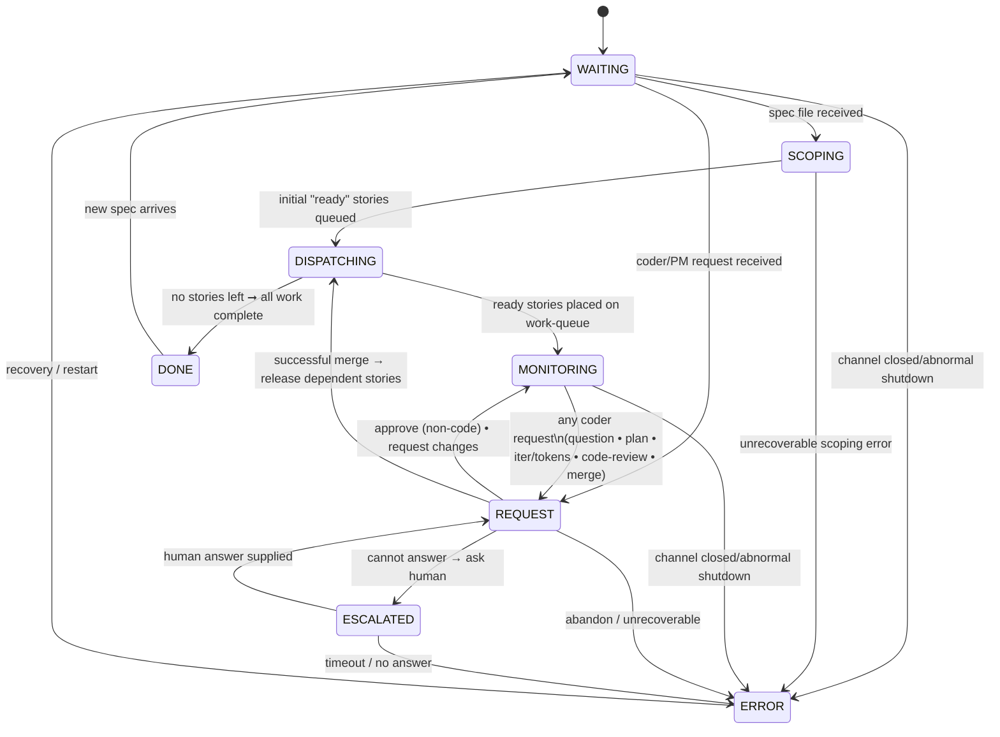

# Architect Agent Finite-State Machine (Canonical)

*Last updated: 2025-01-08 (rev G - PM Spec Review Integration)*

This document is the **single source of truth** for the architect agent's workflow.
Any code, tests, or diagrams must match this specification exactly.

---

## Mermaid diagram

---

## State definitions

| State            | Purpose                                                                        |
| ---------------- | ------------------------------------------------------------------------------ |
| **WAITING**      | Agent is idle, waiting for specification files or requests to process.        |
| **SCOPING**      | Parse specification and generate story files with dependencies.               |
| **DISPATCHING**  | Load stories, check dependencies, and assign ready stories to coder agents.   |
| **MONITORING**   | Monitor coder progress and wait for requests (questions, reviews, merges).    |
| **REQUEST**      | Process requests: coder questions/reviews/merges OR PM spec reviews.          |
| **ESCALATED**    | Waiting for human intervention on complex business questions.                 |
| **DONE**         | All stories completed successfully.                                           |
| **ERROR**        | Unrecoverable error or workflow abandonment.                                  |

---

## Key workflow patterns

### Merge Workflow

- **Merge requests**: Coders send merge requests after code approval via REQUEST state
- **Story completion**: Only happens after successful PR merge (not code approval)
- **Dependency unlocking**: Triggered by merge success, enabling dependent stories
- **Conflict handling**: Merge conflicts returned to coder for resolution
- **Post-merge transition**: Successful merges transition from REQUEST → DISPATCHING to release dependent stories and update mirrors (not REQUEST → MONITORING)

### PM Spec Review Workflow

- **Spec review requests**: PM sends REQUEST(type=spec) after conducting interview and validating spec
- **Review process**: Architect uses SCOPING tools in REQUEST state:
  - `spec_feedback` - Send feedback/questions to PM (status: NEEDS_CHANGES)
  - `submit_stories` - Approve spec and generate stories (status: APPROVED)
- **Iterative review**: PM can resubmit improved spec after addressing feedback
- **Approval outcome**: When architect calls `submit_stories`:
  - Stories are generated and queued
  - RESPONSE(approved=true) sent to PM
  - Architect returns to MONITORING or DISPATCHING (depending on story queue state)

### REQUEST State Handling

The REQUEST state processes different types of approval requests based on `ApprovalType`:

- **ApprovalTypePlan**: Coder plan approval (auto-approved, stored in database)
- **ApprovalTypeCode**: Iterative code review with read tools (approve/request changes)
- **ApprovalTypeCompletion**: Story completion approval (approve/request changes)
- **ApprovalTypeBudgetReview**: Token/iteration budget increase requests
- **ApprovalTypeSpec**: PM spec review with SCOPING tools (NEW - Phase 3)

Each type uses appropriate review logic and tools for its domain.

---

## Error handling

* The agent enters **ERROR** when:

  1. It receives **ABANDON** from escalation or unrecoverable runtime errors.
  2. Specification parsing fails with unrecoverable errors.
  3. Any unrecoverable runtime error occurs (panic, out-of-retries, etc.).

* **ERROR** is terminal until recovery/restart by orchestrator.

## Shutdown handling

* The agent enters **DONE** when:

  1. All stories are completed successfully (normal completion via DISPATCHING state).

* The agent enters **ERROR** when:

  1. It receives **ABANDON** from escalation or unrecoverable runtime errors.
  2. Specification parsing fails with unrecoverable errors.
  3. Any unrecoverable runtime error occurs (panic, out-of-retries, etc.).
  4. Channels are closed unexpectedly during shutdown (abnormal termination).

* **Channel closure detection**: When channels are closed during shutdown, the architect detects this via the two-value receive pattern `msg, ok := <-ch`. When `!ok`, it transitions to **ERROR** state for proper cleanup.

* **DONE** is terminal - the orchestrator handles agent cleanup and restart.

---

*Any deviation from this document is a bug.*

