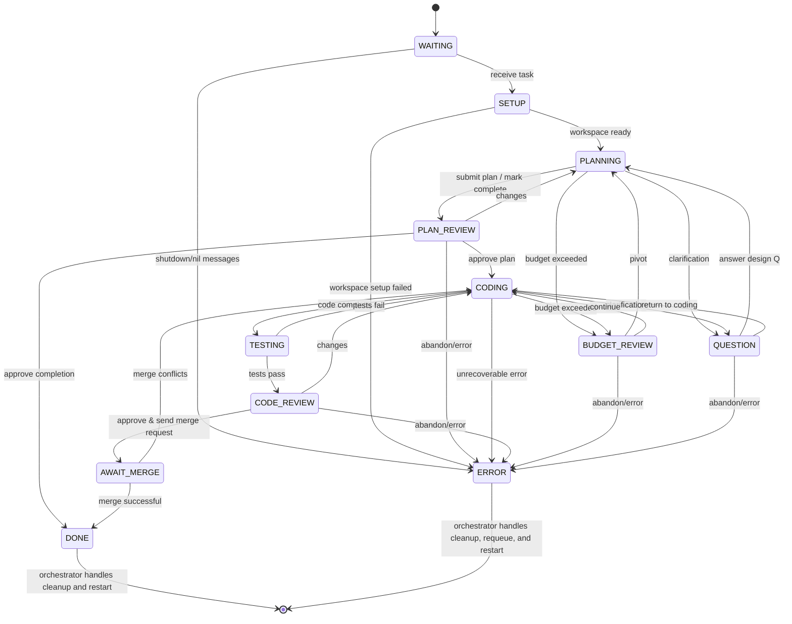

Here's the complete current **STATES.md** content, inline for easy copy-paste:

---

# Coder Agent Finite-State Machine (Canonical)

*Last updated: 2025-07-20 (rev G - Eliminated FIXING State)*

This document is the **single source of truth** for the coder agent's workflow.
Any code, tests, or diagrams must match this specification exactly.

---

## Mermaid diagram



---

## State definitions

| State               | Purpose                                                                        |
| ------------------- | ------------------------------------------------------------------------------ |
| **WAITING**         | Agent is idle, waiting for the orchestrator to assign new work.                |
| **SETUP**           | Initialize Git worktree and create story branch.                               |
| **PLANNING**        | Draft a high-level implementation plan.                                        |
| **PLAN\_REVIEW**    | Architect reviews plan or completion request; approves, requests changes, or abandons. |
| **CODING**          | Implement the approved plan or fix test failures/review issues.                |
| **TESTING**         | Run the automated test suite.                                                  |
| **CODE\_REVIEW**    | Architect reviews the code and either approves, requests changes, or abandons. |
| **BUDGET\_REVIEW**  | Architect reviews budget exceeded request and decides how to proceed. |
| **AWAIT\_MERGE**    | Waiting for architect to merge PR after code approval.                        |
| **QUESTION**        | Awaiting external clarification or information.                                |
| **DONE**            | Agent termination state - orchestrator will shut down and restart agent.       |
| **ERROR**           | Terminal state - task abandoned or unrecoverable failure; orchestrator handles requeue via lease system. |

---

## Allowed transitions (tabular)

| From \ To           | WAITING | SETUP | PLAN\_REVIEW | PLANNING | CODING | TESTING | CODE\_REVIEW | BUDGET\_REVIEW | AWAIT\_MERGE | QUESTION | DONE | ERROR |
| ------------------- | ------- | ----- | ------------ | -------- | ------ | ------- | ------------ | -------------- | ------------ | -------- | ---- | ----- |
| **WAITING**         | –       | ✔︎    | –            | –        | –      | –       | –            | –              | –            | –        | –    | ✔︎    |
| **SETUP**           | –       | –     | –            | ✔︎       | –      | –       | –            | –              | –            | –        | –    | ✔︎    |
| **PLANNING**        | –       | –     | ✔︎           | –        | –      | –       | –            | ✔︎             | –            | ✔︎       | –    | –     |
| **PLAN\_REVIEW**    | –       | –     | –            | ✔︎       | ✔︎     | –       | –            | –              | –            | –        | ✔︎   | ✔︎    |
| **CODING**          | –       | –     | –            | –        | –      | ✔︎      | –            | ✔︎             | –            | ✔︎       | –    | ✔︎    |
| **TESTING**         | –       | –     | –            | –        | ✔︎     | –       | ✔︎           | –              | –            | –        | –    | –     |
| **CODE\_REVIEW**    | –       | –     | –            | –        | ✔︎     | –       | –            | –              | ✔︎           | –        | –    | ✔︎    |
| **BUDGET\_REVIEW**  | –       | –     | –            | ✔︎       | ✔︎     | –       | –            | –              | –            | –        | –    | ✔︎    |
| **AWAIT\_MERGE**    | –       | –     | –            | –        | ✔︎     | –       | –            | –              | –            | –        | ✔︎   | ✔︎    |
| **QUESTION**        | –       | –     | –            | ✔︎       | ✔︎     | –       | –            | –              | –            | –        | –    | ✔︎    |
| **DONE**            | –       | –     | –            | –        | –      | –       | –            | –              | –            | –        | –    | –     |
| **ERROR**           | –       | –     | –            | –        | –      | –       | –            | –              | –            | –        | –    | –     |

*(✔︎ = allowed, — = invalid)*

---

## AUTO\_CHECKIN & deterministic budget overflow

1. **Optional question:** While in `PLANNING` or `CODING`, the LLM may voluntarily ask for clarification and transition to `QUESTION`.
2. **Deterministic budget review:** Each long-running loop has an iteration budget (`planning_iterations`, `coding_iterations`). When exhausted, the agent **must** transition to `BUDGET_REVIEW` requesting one of:
   • **CONTINUE** (same plan)
   • **PIVOT** (small plan change)
   • **ESCALATE** (send to `CODE_REVIEW`)
   • **ABANDON** (abort task)

Upon receiving architect approval:

| Approval Result      | Status Code           | Next state                                                                           |
| -------------------- | -------------------- | ------------------------------------------------------------------------------------ |
| **CONTINUE**         | `ApprovalStatusApproved` | Return to `CODING` and reset counter. |
| **PIVOT**            | `ApprovalStatusNeedsChanges` | Return to `PLANNING` and reset counter. |
| **ABANDON**          | `ApprovalStatusRejected` | Move to `ERROR`.                                                                     |

Note: The architect uses standard approval status codes that map to budget review actions as shown above.

## Plan & Completion Review

Plan reviews (including completion claims) support three-way decisions:

| Approval Result      | Status Code           | Next state                                                                           |
| -------------------- | -------------------- | ------------------------------------------------------------------------------------ |
| **APPROVED**         | `ApprovalStatusApproved` | Proceed to `CODING` (for plans) or `DONE` (for completion claims) |
| **NEEDS_CHANGES**    | `ApprovalStatusNeedsChanges` | Return to `PLANNING` with feedback for refinement |
| **REJECTED**         | `ApprovalStatusRejected` | Move to `ERROR` (abandon story as impossible) |

**Completion Claims**: When coder uses `mark_story_complete` tool, architect can:
- **APPROVED**: Story is truly complete → `DONE`
- **NEEDS_CHANGES**: Missing work identified (tests, docs, etc.) → back to `PLANNING`  
- **REJECTED**: Story approach fundamentally flawed → `ERROR`

---

## Error handling

* The agent enters **ERROR** when:

  1. It receives **ABANDON** from `PLAN_REVIEW`, `CODE_REVIEW`, `BUDGET_REVIEW`, or `QUESTION`.
  2. An **auto-approve** request is rejected with ABANDON.
  3. Any unrecoverable runtime error occurs (panic, out-of-retries, etc.).
  4. Multiple consecutive nil messages are received in **WAITING** state (shutdown scenario).
* **ERROR** is terminal - the orchestrator handles story requeue and agent restart via lease system.

---

## Worktree & Merge Workflow Integration

This FSM includes **Git worktree support** and **merge workflow**:

### Key States:
- **SETUP**: Initialize Git worktree and story branch (entry state before PLANNING)
- **BUDGET_REVIEW**: Architect reviews budget exceeded request when iteration budget is exceeded

### Special Transitions:
- **PLAN_REVIEW → DONE**: Direct completion when architect approves completion request (via `mark_story_complete` tool)
- **PLAN_REVIEW → PLANNING**: Return to planning when architect identifies missing work in completion request
- **AWAIT_MERGE**: Wait for architect merge result after PR creation
- **DONE**: Terminal state - orchestrator will shut down and restart agent with clean state

### Enhanced States:
- **CODING**: Handles initial implementation, test failure fixes, review issue fixes, and merge conflict resolution
- **ERROR**: Transitions to DONE for orchestrator cleanup and restart

### Workflow Flow:
```
WAITING → SETUP → PLANNING → CODING → TESTING → CODE_REVIEW → AWAIT_MERGE → DONE
                    ↑         ↑         ↑           ↑             ↑           ↓
                    └─────────┴─────────┴───────────┴─────────────┘    [agent restart]
                              ↑         ↑                              ↓
                              └─BUDGET_REVIEW─┘                    WAITING (new agent)
```

### Issue Resolution in CODING:
1. **Test failures**: `TESTING → CODING` (with test output in state data)
2. **Review changes**: `CODE_REVIEW → CODING` (with review feedback in state data)  
3. **Merge conflicts**: `AWAIT_MERGE → CODING` (with conflict details in state data)
4. All issues resolved in unified CODING state with appropriate context

### Agent Restart Workflow:
- **Story completion**: `AWAIT_MERGE → DONE` (merge successful)  
- **Error recovery**: Any state → `ERROR` (unrecoverable failure)
- **Terminal states**: Both DONE and ERROR are truly terminal - agents do no work
- **Orchestrator actions**: On DONE/ERROR states, orchestrator handles all cleanup and restart
- **Lease system**: Orchestrator tracks story assignments and requeues failed stories automatically
- **Complete cleanup**: All resources deleted (workspace, containers, state) for clean slate
- **Future metrics**: Orchestrator will aggregate metrics across agent restarts (not yet implemented)

---

*Any deviation from this document is a bug.*

