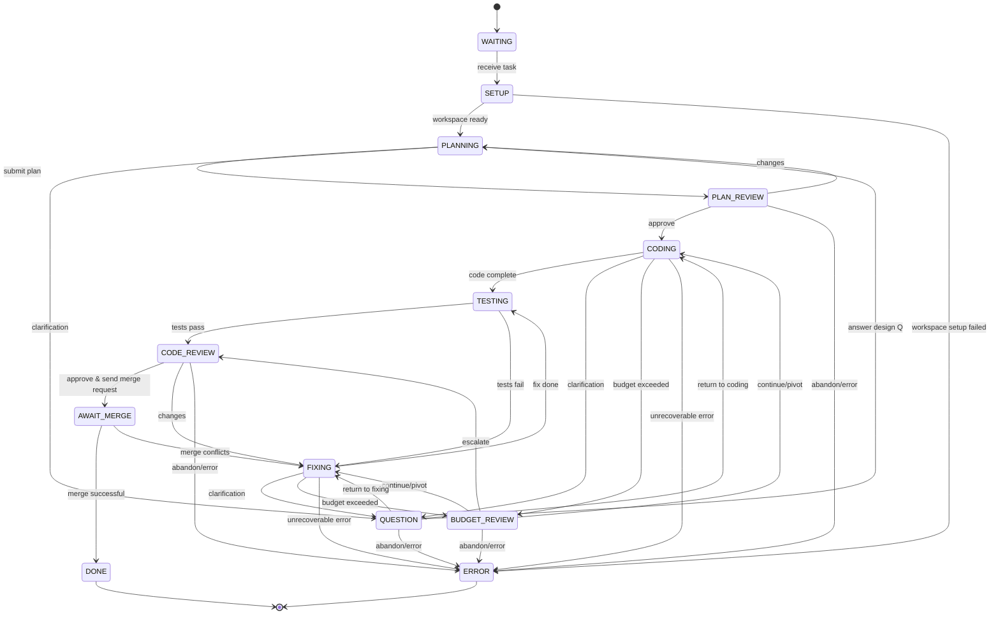

Here’s the complete current **STATES.md** content, inline for easy copy-paste:

---

# Coder Agent Finite-State Machine (Canonical)

*Last updated: 2025-07-13 (rev D - Merge Workflow)*

This document is the **single source of truth** for the coder agent’s workflow.
Any code, tests, or diagrams must match this specification exactly.

---

## Mermaid diagram



---

## State definitions

| State               | Purpose                                                                        |
| ------------------- | ------------------------------------------------------------------------------ |
| **WAITING**         | Agent is idle, waiting for the orchestrator to assign new work.                |
| **SETUP**           | Initialize Git worktree and create story branch.                               |
| **PLANNING**        | Draft a high-level implementation plan.                                        |
| **PLAN\_REVIEW**    | Architect reviews the plan and either approves, requests changes, or abandons. |
| **CODING**          | Implement the approved plan.                                                   |
| **TESTING**         | Run the automated test suite.                                                  |
| **FIXING**          | Address test failures, review changes, or merge conflicts.                     |
| **CODE\_REVIEW**    | Architect reviews the code and either approves, requests changes, or abandons. |
| **BUDGET\_REVIEW**  | Architect reviews budget exceeded request and decides how to proceed. |
| **AWAIT\_MERGE**    | Waiting for architect to merge PR after code approval.                        |
| **QUESTION**        | Awaiting external clarification or information.                                |
| **DONE**            | Task fully approved and PR successfully merged.                                |
| **ERROR**           | Task abandoned or unrecoverable failure encountered.                           |

---

## Allowed transitions (tabular)

| From \ To           | WAITING | SETUP | PLAN\_REVIEW | PLANNING | CODING | TESTING | FIXING | CODE\_REVIEW | BUDGET\_REVIEW | AWAIT\_MERGE | QUESTION | DONE | ERROR |
| ------------------- | ------- | ----- | ------------ | -------- | ------ | ------- | ------ | ------------ | -------------- | ------------ | -------- | ---- | ----- |
| **WAITING**         | –       | ✔︎    | –            | –        | –      | –       | –      | –            | –              | –            | –        | –    | –     |
| **SETUP**           | –       | –     | –            | ✔︎       | –      | –       | –      | –            | –              | –            | –        | –    | ✔︎    |
| **PLANNING**        | –       | –     | ✔︎           | –        | –      | –       | –      | –            | –              | –            | ✔︎       | –    | –     |
| **PLAN\_REVIEW**    | –       | –     | –            | ✔︎       | ✔︎     | –       | –      | –            | –              | –            | –        | –    | ✔︎    |
| **CODING**          | –       | –     | –            | –        | –      | ✔︎      | –      | –            | ✔︎             | –            | ✔︎       | –    | ✔︎    |
| **TESTING**         | –       | –     | –            | –        | –      | –       | ✔︎     | ✔︎           | –              | –            | –        | –    | –     |
| **FIXING**          | –       | –     | –            | –        | –      | ✔︎      | –      | –            | ✔︎             | –            | ✔︎       | –    | ✔︎    |
| **CODE\_REVIEW**    | –       | –     | –            | –        | –      | –       | ✔︎     | –            | –              | ✔︎           | –        | –    | ✔︎    |
| **BUDGET\_REVIEW**  | –       | –     | –            | –        | ✔︎     | –       | ✔︎     | ✔︎           | –              | –            | –        | –    | ✔︎    |
| **AWAIT\_MERGE**    | –       | –     | –            | –        | –      | –       | ✔︎     | –            | –              | –            | –        | ✔︎   | –     |
| **QUESTION**        | –       | –     | –            | ✔︎       | ✔︎     | –       | ✔︎     | –            | –              | –            | –        | –    | ✔︎    |
| **DONE**            | –       | –     | –            | –        | –      | –       | –      | –            | –              | –            | –        | –    | –     |
| **ERROR**           | –       | –     | –            | –        | –      | –       | –      | –            | –              | –            | –        | –    | –     |

*(✔︎ = allowed, — = invalid)*

---

## AUTO\_CHECKIN & deterministic budget overflow

1. **Optional question:** While in `CODING` or `FIXING`, the LLM may voluntarily ask for clarification and transition to `QUESTION`.
2. **Deterministic budget review:** Each long-running loop has an iteration budget (`coding_iterations`, `fixing_iterations`). When exhausted, the agent **must** transition to `BUDGET_REVIEW` requesting one of:
   • **CONTINUE** (same plan)
   • **PIVOT** (small plan change)
   • **ESCALATE** (send to `CODE_REVIEW`)
   • **ABANDON** (abort task)

Upon receiving architect approval:

| Approval Result      | Next state                                                                |
| -------------------- | ------------------------------------------------------------------------- |
| **CONTINUE / PIVOT** | Return to the originating state (`CODING` or `FIXING`) and reset counter. |
| **ESCALATE**         | Move to `CODE_REVIEW`.                                                    |
| **ABANDON**          | Move to `ERROR`.                                                          |

---

## Error handling

* The agent enters **ERROR** when:

  1. It receives **ABANDON** from `PLAN_REVIEW`, `CODE_REVIEW`, `BUDGET_REVIEW`, or `QUESTION`.
  2. An **auto-approve** request is rejected with ABANDON.
  3. Any unrecoverable runtime error occurs (panic, out-of-retries, etc.).
* **ERROR** is terminal; orchestrator decides next steps.

---

## Worktree & Merge Workflow Integration

This FSM now includes **Git worktree support** and **merge workflow**:

### New States:
- **SETUP**: Initialize Git worktree and story branch (entry state before PLANNING)
- **BUDGET_REVIEW**: Architect reviews budget exceeded request when iteration budget is exceeded
- **AWAIT_MERGE**: Wait for architect merge result after PR creation

### Enhanced States:
- **FIXING**: Now handles merge conflicts in addition to test failures and review rejections
- **DONE**: Only reached after successful PR merge (not just code approval)

### Workflow Flow:
```
WAITING → SETUP → PLANNING → CODING → TESTING → CODE_REVIEW → AWAIT_MERGE → DONE
                    ↑         ↑         ↑           ↑             ↑
                    └─────────┴─────────┴───FIXING──┴─────────────┘
                              ↑         ↑
                              └─BUDGET_REVIEW─┘
```

### Merge Conflict Resolution:
1. Code approved → PR created → merge request sent to architect
2. Architect attempts merge using `gh pr merge --squash --delete-branch`
3. If conflicts: `AWAIT_MERGE → FIXING(reason=merge_conflict) → TESTING → CODE_REVIEW`
4. If success: `AWAIT_MERGE → DONE` (story completed, dependencies unlocked)

---

*Any deviation from this document is a bug.*

