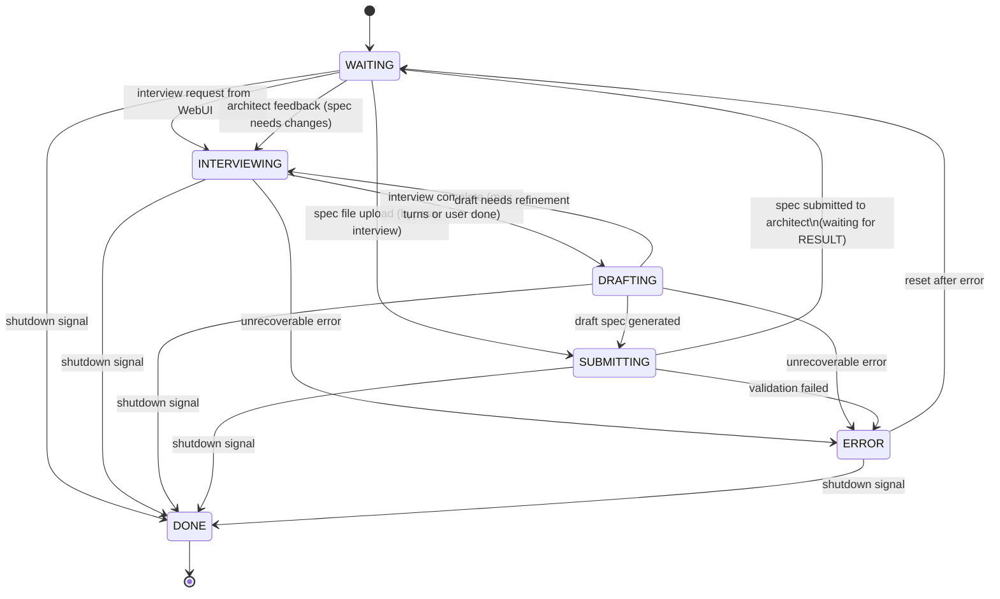

# PM Agent Finite-State Machine (Canonical)

*Last updated: 2025-01-08 (Initial version with Architect feedback loop)*

This document is the **single source of truth** for the PM (Product Manager) agent's workflow.
Any code, tests, or diagrams must match this specification exactly.

---

## Mermaid diagram

---

## State definitions

| State              | Purpose                                                                        |
| ------------------ | ------------------------------------------------------------------------------ |
| **WAITING**        | Idle state waiting for interview request OR architect feedback.               |
| **INTERVIEWING**   | Conducting requirements interview with user via WebUI chat.                   |
| **DRAFTING**       | Generating markdown specification from conversation history.                  |
| **SUBMITTING**     | Validating spec and sending to architect for review.                          |
| **DONE**           | Terminal state - PM agent shutdown.                                           |
| **ERROR**          | Unrecoverable error state - resets to WAITING.                                |

---

## Key workflow patterns

### Interview Initiation

PM can receive work in three ways:

1. **New Interview**: User sends interview request via WebUI → PM enters INTERVIEWING
2. **Iteration**: Architect sends RESULT(needs_changes) → PM enters INTERVIEWING with feedback context
3. **Direct Spec Upload**: User uploads spec file directly → PM enters SUBMITTING (bypasses interview)

### Architect Feedback Loop

1. **PM Submits Spec**:
   - PM in SUBMITTING state calls `spec_submit` tool
   - Tool validates spec (YAML frontmatter, required sections, dependencies)
   - PM sends REQUEST(type=spec) message to architect
   - PM transitions to WAITING (with `pending_request_id` in state)

2. **Architect Reviews**:
   - Architect receives REQUEST in handleSpecReview()
   - Uses SCOPING tools to review spec:
     - `spec_feedback` → Request changes with feedback
     - `submit_stories` → Approve and generate stories
   - Sends RESPONSE message with ApprovalResult

3. **PM Receives Result**:
   - WAITING state monitors `replyCh` for RESULT message
   - **If APPROVED**: Clear state, stay in WAITING for next interview
   - **If NEEDS_CHANGES**: Store feedback, transition to INTERVIEWING

### Spec File Upload (Bypass Interview)

PM can accept pre-written spec files to bypass the interview phase:

1. **Spec Upload**: User/system sends spec file via `specCh`
2. **Direct to SUBMITTING**: PM stores spec as `draft_spec` and transitions to SUBMITTING
3. **Validation**: spec_submit tool validates the spec
4. **Submission**: If valid, REQUEST sent to architect; if invalid, transitions to INTERVIEWING for fixes

This bypass is useful for:
- Production testing the spec review workflow
- Submitting pre-written specifications
- Iterating on specs after architect feedback without re-interviewing

### Channel Monitoring

The WAITING state uses a select statement to monitor:
- `ctx.Done()` - Shutdown signal
- `interviewRequestCh` - New interview requests from WebUI
- `specCh` - Direct spec file uploads (bypass interview)
- `replyCh` - Architect RESULT messages

---

## Interview workflow

### INTERVIEWING State

- Conducts multi-turn conversation with user via WebUI chat
- Uses LLM with read-only tools (`list_files`, `read_file`) to explore codebase
- Tracks conversation history and turn count
- Continues until:
  - User signals completion
  - Max turns reached (configured limit)
  - User provides sufficient requirements

### DRAFTING State

- Generates markdown specification from conversation
- Uses spec generation template with LLM
- Creates YAML frontmatter with metadata
- Structures requirements with acceptance criteria
- Validates basic format before submission

### SUBMITTING State

- Calls `spec_submit` tool for validation:
  - YAML frontmatter validation
  - Required sections (Vision, Scope, Requirements)
  - Requirement ID format and uniqueness
  - Acceptance criteria presence
  - Dependency graph acyclicity
- On validation success:
  - Creates REQUEST message with spec content
  - Sends to architect via Effects
  - Transitions to WAITING with pending request tracking
- On validation failure:
  - Stores validation errors
  - Returns to INTERVIEWING to fix issues

---

## Error handling

* The agent enters **ERROR** when:
  1. Unrecoverable errors during interview, drafting, or submission
  2. Channel errors or unexpected message types
  3. Tool execution failures

* **ERROR** state transitions to **WAITING** for recovery (not terminal)

---

## Shutdown handling

* The agent enters **DONE** when:
  1. Shutdown signal received (context cancellation)
  2. Interview request channel closed

* **DONE** is terminal - orchestrator handles cleanup

---

## Message protocol

### Outgoing Messages (PM → Architect)

**REQUEST (spec_review)**:
- Type: `MsgTypeREQUEST`
- Payload: `ApprovalRequestPayload`
  - `ApprovalType`: `ApprovalTypeSpec`
  - `Content`: Brief spec summary
  - `Reason`: "PM has completed spec interview and generated specification for review"
  - `Metadata["spec_markdown"]`: Full spec content
- Sent via Effects system after successful validation

### Incoming Messages (Architect → PM)

**RESPONSE (approval_result)**:
- Type: `MsgTypeRESPONSE`
- Payload: `ApprovalResult`
  - `Status`: `ApprovalStatusApproved` OR `ApprovalStatusNeedsChanges`
  - `Feedback`: Review feedback or approval message
  - `Type`: `ApprovalTypeSpec`
- Received on `replyCh` in WAITING state

---

## State transition matrix

| From State      | To State       | Trigger                                      |
| --------------- | -------------- | -------------------------------------------- |
| WAITING         | INTERVIEWING   | Interview request OR architect feedback      |
| WAITING         | SUBMITTING     | Direct spec file upload                      |
| WAITING         | DONE           | Shutdown signal                              |
| INTERVIEWING    | DRAFTING       | Interview complete                           |
| INTERVIEWING    | ERROR          | Unrecoverable error                          |
| INTERVIEWING    | DONE           | Shutdown signal                              |
| DRAFTING        | SUBMITTING     | Draft generated                              |
| DRAFTING        | INTERVIEWING   | Draft refinement needed                      |
| DRAFTING        | ERROR          | Unrecoverable error                          |
| DRAFTING        | DONE           | Shutdown signal                              |
| SUBMITTING      | WAITING        | Spec submitted to architect                  |
| SUBMITTING      | ERROR          | Validation failure                           |
| SUBMITTING      | DONE           | Shutdown signal                              |
| ERROR           | WAITING        | Reset after error                            |
| ERROR           | DONE           | Shutdown signal                              |

---

*Any deviation from this document is a bug.*
