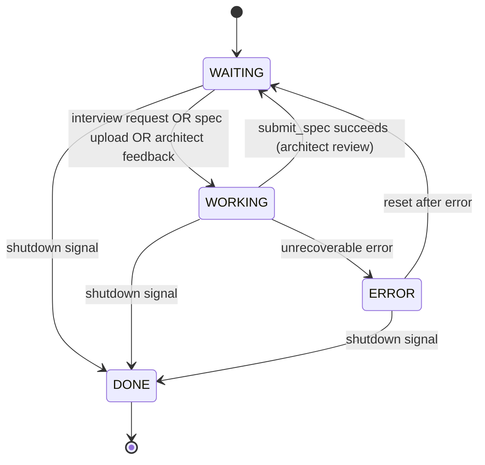

# PM Agent Finite-State Machine (Canonical)

*Last updated: 2025-01-09 (Simplified to WAITING/WORKING states with tool-driven flow)*

This document is the **single source of truth** for the PM (Product Manager) agent's workflow.
Any code, tests, or diagrams must match this specification exactly.

---

## Mermaid diagram

---

## State definitions

| State              | Purpose                                                                        |
| ------------------ | ------------------------------------------------------------------------------ |
| **WAITING**        | Idle state waiting for interview request, spec upload, or architect feedback. |
| **WORKING**        | Active work state - interviewing, drafting, and submitting via tools.         |
| **DONE**           | Terminal state - PM agent shutdown.                                           |
| **ERROR**          | Unrecoverable error state - resets to WAITING.                                |

---

## Key workflow patterns

### Work Initiation

PM can receive work in three ways:

1. **New Interview**: User sends interview request via WebUI → PM enters WORKING
2. **Iteration**: Architect sends RESULT(needs_changes) → PM enters WORKING with feedback context
3. **Direct Spec Upload**: User uploads spec file directly → PM enters WORKING with pre-loaded spec

All paths lead to WORKING state where PM has access to all tools.

### Tool-Driven Workflow

In WORKING state, PM has access to all tools:

- **chat_post**: Communicate with user via product channel (pm-* agents route to product)
- **read_file**: Read files from codebase for context
- **list_files**: List files in codebase for exploration
- **spec_submit**: Validate and submit spec to architect

PM uses LLM reasoning to decide when to:
- Ask user questions via chat_post
- Explore codebase via read_file/list_files
- Submit spec via spec_submit

When spec_submit succeeds, PM transitions back to WAITING.

### Architect Feedback Loop (Non-Blocking)

1. **PM Submits Spec**:
   - PM in WORKING state calls `spec_submit` tool
   - Tool validates spec (YAML frontmatter, required sections, dependencies)
   - Tool sends REQUEST(type=spec) message to architect
   - Tool returns success, PM transitions to WAITING

2. **Architect Reviews**:
   - Architect receives REQUEST in handleSpecReview()
   - Uses SCOPING tools to review spec:
     - `spec_feedback` → Request changes with feedback
     - `submit_stories` → Approve and generate stories
   - Sends RESPONSE message with ApprovalResult

3. **PM Receives Result**:
   - WAITING state monitors `replyCh` for RESULT message
   - **If APPROVED**: Clear state, stay in WAITING for next interview
   - **If NEEDS_CHANGES**: Store feedback, transition to WORKING

Alternatively, if PM is already WORKING when feedback arrives:
- WORKING state checks `replyCh` non-blocking
- If feedback available, adds to context for next LLM call
- PM continues work with architect feedback incorporated

### Channel Monitoring

The WAITING state uses a select statement to monitor:
- `ctx.Done()` - Shutdown signal
- `interviewRequestCh` - New interview requests from WebUI
- `specCh` - Direct spec file uploads
- `replyCh` - Architect RESULT messages (approval or feedback)

---

## Unified workflow in WORKING state

### WORKING State

The WORKING state unifies all PM activities (interviewing, drafting, submitting) into a single LLM-driven workflow with full tool access.

**Available Tools:**
- `chat_post` - Communicate with user via product channel
- `read_file` - Read files from codebase for context
- `list_files` - List files in workspace for exploration
- `spec_submit` - Validate and submit specification to architect

**LLM Reasoning Flow:**
1. PM receives conversation history and any architect feedback
2. PM decides whether to:
   - Ask clarifying questions via `chat_post`
   - Explore codebase via `read_file`/`list_files`
   - Draft specification internally
   - Submit specification via `spec_submit`
3. PM iterates until specification is ready
4. PM calls `spec_submit` tool which:
   - Validates YAML frontmatter
   - Validates required sections (Vision, Scope, Requirements)
   - Validates requirement IDs and dependencies
   - Sends REQUEST message to architect
   - Returns success → PM transitions to WAITING

**No State Transitions Within WORKING:**
- PM doesn't transition between INTERVIEWING → DRAFTING → SUBMITTING
- PM stays in WORKING and uses tools to accomplish all tasks
- Only transition out of WORKING is via successful `spec_submit` → WAITING

**Async Feedback Handling:**
- WORKING state checks `replyCh` non-blocking
- If architect feedback arrives, adds to context
- PM incorporates feedback in next LLM call

---

## Error handling

* The agent enters **ERROR** when:
  1. Unrecoverable errors during interview, drafting, or submission
  2. Channel errors or unexpected message types
  3. Tool execution failures

* **ERROR** state transitions to **WAITING** for recovery (not terminal)

---

## Shutdown handling

* The agent enters **DONE** when:
  1. Shutdown signal received (context cancellation)
  2. Interview request channel closed

* **DONE** is terminal - orchestrator handles cleanup

---

## Message protocol

### Outgoing Messages (PM → Architect)

**REQUEST (spec_review)**:
- Type: `MsgTypeREQUEST`
- Payload: `ApprovalRequestPayload`
  - `ApprovalType`: `ApprovalTypeSpec`
  - `Content`: Brief spec summary
  - `Reason`: "PM has completed spec interview and generated specification for review"
  - `Metadata["spec_markdown"]`: Full spec content
- Sent via Effects system after successful validation

### Incoming Messages (Architect → PM)

**RESPONSE (approval_result)**:
- Type: `MsgTypeRESPONSE`
- Payload: `ApprovalResult`
  - `Status`: `ApprovalStatusApproved` OR `ApprovalStatusNeedsChanges`
  - `Feedback`: Review feedback or approval message
  - `Type`: `ApprovalTypeSpec`
- Received on `replyCh` in WAITING state

---

## State transition matrix

| From State      | To State       | Trigger                                      |
| --------------- | -------------- | -------------------------------------------- |
| WAITING         | WORKING        | Interview request OR spec upload OR feedback |
| WAITING         | DONE           | Shutdown signal                              |
| WORKING         | WAITING        | spec_submit succeeds                         |
| WORKING         | ERROR          | Unrecoverable error                          |
| WORKING         | DONE           | Shutdown signal                              |
| ERROR           | WAITING        | Reset after error                            |
| ERROR           | DONE           | Shutdown signal                              |

---

*Any deviation from this document is a bug.*
