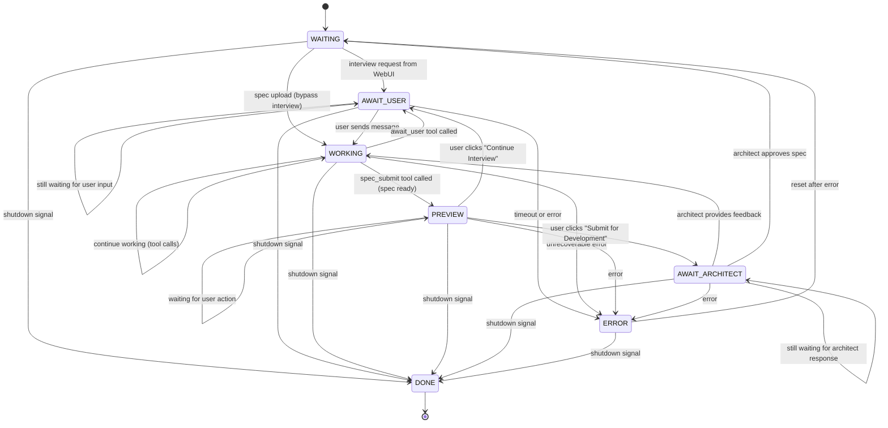

# PM Agent Finite-State Machine (Canonical)

*Last updated: 2025-01-11 (Added PREVIEW and AWAIT_ARCHITECT states for user review workflow)*

This document is the **single source of truth** for the PM (Product Manager) agent's workflow.
Any code, tests, or diagrams must match this specification exactly.

---

## Mermaid diagram

---

## State definitions

| State                  | Purpose                                                                              |
| ---------------------- | ------------------------------------------------------------------------------------ |
| **WAITING**            | Idle state waiting for interview request, spec upload, or architect feedback.       |
| **AWAIT_USER**         | Blocked waiting for user's response in chat. Polls chat channel for new messages.   |
| **WORKING**            | Active work state - interviewing, drafting, and calling tools.                      |
| **PREVIEW**            | Spec ready for user review. User chooses to continue interview or submit.           |
| **AWAIT_ARCHITECT**    | Blocked waiting for architect's RESULT message (feedback or approval).              |
| **DONE**               | Terminal state - PM agent shutdown.                                                 |
| **ERROR**              | Unrecoverable error state - resets to WAITING.                                      |

---

## Key workflow patterns

### Work Initiation

PM can receive work in three ways:

1. **New Interview**: User sends interview request via WebUI → PM enters AWAIT_USER
2. **Iteration**: Architect sends RESULT(needs_changes) → PM enters WORKING with feedback context
3. **Direct Spec Upload**: User uploads spec file directly → PM enters WORKING with pre-loaded spec

### Tool-Driven Workflow

In WORKING state, PM has access to all tools:

- **chat_post**: Communicate with user via product channel (pm-* agents route to product)
- **read_file**: Read files from codebase for context
- **list_files**: List files in codebase for exploration
- **await_user**: Block and wait for user's next message (transitions to AWAIT_USER state)
- **spec_submit**: Validate and prepare spec for user review (transitions to PREVIEW state)

PM uses LLM reasoning to decide when to:
- Ask user questions via chat_post
- Explore codebase via read_file/list_files
- Wait for user input via await_user
- Generate spec for preview via spec_submit

### Preview and Submission Flow

1. **PM Generates Spec**:
   - PM in WORKING state calls `spec_submit` tool
   - Tool validates spec (YAML frontmatter, required sections, dependencies)
   - Tool stores spec in PM state (draft_spec_markdown, spec_metadata)
   - Tool returns `preview_ready` signal
   - PM transitions to PREVIEW state
   - WebUI automatically switches to preview tab

2. **User Reviews Spec**:
   - WebUI fetches spec via `/api/pm/preview/spec` endpoint
   - User sees rendered markdown preview
   - **Two options:**
     - **Continue Interview**: User clicks button → PM receives `continue_interview` action → PM → AWAIT_USER
     - **Submit for Development**: User clicks button → PM receives `submit_to_architect` action → PM → AWAIT_ARCHITECT

3. **Architect Reviews**:
   - PM in AWAIT_ARCHITECT sends REQUEST(type=spec) message to architect
   - Blocks on `replyCh` waiting for RESULT message
   - Architect receives REQUEST in handleSpecReview()
   - Architect uses SCOPING tools to review spec:
     - `spec_feedback` → Request changes with feedback
     - `submit_stories` → Approve and generate stories
   - Architect sends RESULT message with approval outcome

4. **PM Receives Result**:
   - AWAIT_ARCHITECT state blocks on `replyCh` for RESULT message
   - **If APPROVED**: Clear state, transition to WAITING for next interview
   - **If NEEDS_CHANGES**: Store feedback, transition to WORKING with feedback context

### Architect Feedback Loop

1. **PM Submits Spec**:
   - PM in AWAIT_ARCHITECT sends REQUEST(type=spec) message to architect
   - Blocks on response channel waiting for RESULT message

2. **Architect Reviews**:
   - Architect receives REQUEST in SCOPING state
   - Uses read tools to inspect spec if needed
   - **Two outcomes:**
     - **Feedback**: `spec_feedback(feedback="...")` → sends `RESULT(approved=false, feedback=...)`
     - **Approval**: `submit_stories(stories=[...])` → sends `RESULT(approved=true)` + generates stories

3. **PM Receives Result**:
   - AWAIT_ARCHITECT state receives RESULT message
   - **If APPROVED**: Clear state, transition to WAITING
   - **If NEEDS_CHANGES**: Store feedback, transition to WORKING
   - Feedback is injected into context for next LLM call

### Channel Monitoring

The WAITING state uses a select statement to monitor:
- `ctx.Done()` - Shutdown signal
- `interviewRequestCh` - New interview requests from WebUI
- `specCh` - Direct spec file uploads
- `replyCh` - Architect RESULT messages (approval or feedback)

The AWAIT_USER state polls the chat channel:
- Periodically checks for new user messages
- Transitions to WORKING when messages arrive

The AWAIT_ARCHITECT state blocks on response channel:
- Waits for RESULT message from architect
- No polling - true blocking wait

---

## State Handler Responsibilities

### WAITING State

**Channels Monitored:**
- `interviewRequestCh` - New interview requests
- `specCh` - Direct spec file uploads
- `replyCh` - Architect feedback/approval

**Behavior:**
- Blocks on select statement
- Routes to appropriate next state based on input

### AWAIT_USER State

**Purpose:** Wait for user's response in chat

**Behavior:**
- Polls chat channel for new messages (1-second intervals)
- Transitions to WORKING when new messages arrive
- Uses chat middleware to track read position

### WORKING State

**Available Tools:**
- `chat_post` - Communicate with user
- `read_file` - Read files from codebase
- `list_files` - List files in workspace
- `await_user` - Wait for user input (triggers AWAIT_USER transition)
- `spec_submit` - Generate spec for preview (triggers PREVIEW transition)

**LLM Reasoning Flow:**
1. PM receives conversation history and any architect feedback
2. PM decides whether to:
   - Ask clarifying questions via `chat_post`
   - Explore codebase via `read_file`/`list_files`
   - Wait for user input via `await_user`
   - Generate specification via `spec_submit`
3. PM iterates until ready to transition

### PREVIEW State

**Purpose:** User reviews spec before architect submission

**Channels Monitored:**
- `interviewRequestCh` - Receives user actions (continue_interview, submit_to_architect)
- `ctx.Done()` - Shutdown signal

**Behavior:**
- Blocks on select statement
- Handles two user actions:
  - `continue_interview` → Injects "What changes would you like?" → AWAIT_USER
  - `submit_to_architect` → Sends REQUEST to architect → AWAIT_ARCHITECT

**WebUI Integration:**
- WebUI polls `/api/pm/status` and auto-switches to preview tab
- WebUI fetches spec via `/api/pm/preview/spec`
- WebUI sends actions via `/api/pm/preview/action`

### AWAIT_ARCHITECT State

**Purpose:** Wait for architect's review response

**Channels Monitored:**
- `replyCh` - RESULT messages from architect
- `ctx.Done()` - Shutdown signal

**Behavior:**
- Blocks on response channel (true blocking, no polling)
- Handles two outcomes:
  - `RESULT(approved=true)` → Clear state, transition to WAITING
  - `RESULT(approved=false)` → Store feedback, inject system message, transition to WORKING

**Feedback Handling:**
- System message format: "The architect provided the following feedback on your spec. Address these issues and resubmit or ask the user for any needed clarifications. The user has not seen the raw feedback. <architect_response>"
- PM processes feedback and may ask user questions based on expertise level

---

## Error handling

* The agent enters **ERROR** when:
  1. Unrecoverable errors during interview, drafting, or submission
  2. Channel errors or unexpected message types
  3. Tool execution failures

* **ERROR** state transitions to **WAITING** for recovery (not terminal)

---

## Shutdown handling

* The agent enters **DONE** when:
  1. Shutdown signal received (context cancellation)
  2. Interview request channel closed

* **DONE** is terminal - orchestrator handles cleanup

---

## Message protocol

### Outgoing Messages (PM → Architect)

**REQUEST (spec_review)**:
- Type: `MsgTypeREQUEST`
- Payload: `ApprovalRequestPayload`
  - `ApprovalType`: `ApprovalTypeSpec`
  - `Content`: Brief spec summary
  - `Reason`: "PM has completed spec interview and generated specification for review"
  - `Metadata["spec_markdown"]`: Full spec content
- Sent from AWAIT_ARCHITECT state when user clicks "Submit for Development"

### Incoming Messages (Architect → PM)

**RESULT (approval_result)**:
- Type: `MsgTypeRESULT`
- Payload: `ApprovalResult`
  - `Status`: `ApprovalStatusApproved` OR `ApprovalStatusNeedsChanges`
  - `Feedback`: Review feedback or approval message
  - `Type`: `ApprovalTypeSpec`
- Received on `replyCh` in AWAIT_ARCHITECT state

### Internal Messages (WebUI → PM)

**Interview Actions (via interviewRequestCh)**:
- Type: String actions
- Values:
  - `"continue_interview"` - User wants to refine spec (PREVIEW → AWAIT_USER)
  - `"submit_to_architect"` - User approves spec for submission (PREVIEW → AWAIT_ARCHITECT)

---

## State transition matrix

| From State          | To State            | Trigger                                          |
| ------------------- | ------------------- | ------------------------------------------------ |
| WAITING             | AWAIT_USER          | Interview request from WebUI                     |
| WAITING             | WORKING             | Spec file upload (bypass interview)              |
| WAITING             | DONE                | Shutdown signal                                  |
| AWAIT_USER          | AWAIT_USER          | Still waiting for user input                     |
| AWAIT_USER          | WORKING             | User sends message via chat                      |
| AWAIT_USER          | ERROR               | Timeout or error                                 |
| AWAIT_USER          | DONE                | Shutdown signal                                  |
| WORKING             | WORKING             | Continue working (tool calls)                    |
| WORKING             | AWAIT_USER          | await_user tool called                           |
| WORKING             | PREVIEW             | spec_submit tool called (spec ready)             |
| WORKING             | ERROR               | Unrecoverable error                              |
| WORKING             | DONE                | Shutdown signal                                  |
| PREVIEW             | PREVIEW             | Waiting for user action                          |
| PREVIEW             | AWAIT_USER          | User clicks "Continue Interview"                 |
| PREVIEW             | AWAIT_ARCHITECT     | User clicks "Submit for Development"             |
| PREVIEW             | ERROR               | Error                                            |
| PREVIEW             | DONE                | Shutdown signal                                  |
| AWAIT_ARCHITECT     | AWAIT_ARCHITECT     | Still waiting for architect response             |
| AWAIT_ARCHITECT     | WORKING             | Architect provides feedback (needs changes)      |
| AWAIT_ARCHITECT     | WAITING             | Architect approves spec                          |
| AWAIT_ARCHITECT     | ERROR               | Error                                            |
| AWAIT_ARCHITECT     | DONE                | Shutdown signal                                  |
| ERROR               | WAITING             | Reset after error                                |
| ERROR               | DONE                | Shutdown signal                                  |

---

*Any deviation from this document is a bug.*
