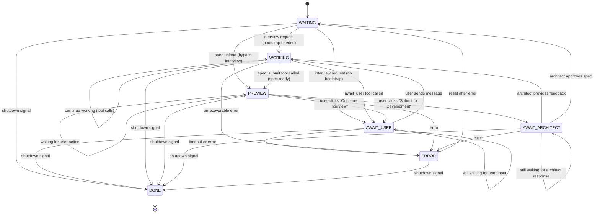

# PM Agent Finite-State Machine (Canonical)

*Last updated: 2025-01-12 (Refactored to direct method calls with mutex protection; removed channel-based state changes)*

This document is the **single source of truth** for the PM (Product Manager) agent's workflow.
Any code, tests, or diagrams must match this specification exactly.

---

## Mermaid diagram

---

## State definitions

| State                  | Purpose                                                                              |
| ---------------------- | ------------------------------------------------------------------------------------ |
| **WAITING**            | Idle state. Public methods (StartInterview, UploadSpec, PreviewAction) trigger transitions. |
| **AWAIT_USER**         | Blocked waiting for user's response in chat. Polls chat channel for new messages.   |
| **WORKING**            | Active work state - interviewing, drafting, and calling tools.                      |
| **PREVIEW**            | Spec ready for user review. User chooses to continue interview or submit.           |
| **AWAIT_ARCHITECT**    | Blocked waiting for architect's RESULT message (feedback or approval).              |
| **DONE**               | Terminal state - PM agent shutdown.                                                 |
| **ERROR**              | Unrecoverable error state - resets to WAITING.                                      |

---

## Key workflow patterns

### Work Initiation

PM can receive work in three ways:

1. **New Interview**: User sends interview request via WebUI → PM.StartInterview()
   - If bootstrap needed: → WORKING (PM proactively sets up project)
   - If no bootstrap: → AWAIT_USER (PM waits for user to describe feature)
2. **Iteration**: Architect sends RESULT(needs_changes) → PM enters WORKING with feedback context
3. **Direct Spec Upload**: User uploads spec file directly → PM.UploadSpec() → PREVIEW with pre-loaded spec

### Tool-Driven Workflow

In WORKING state, PM has access to all tools:

- **chat_post**: Communicate with user via product channel (pm-* agents route to product)
- **read_file**: Read files from codebase for context
- **list_files**: List files in codebase for exploration
- **await_user**: Block and wait for user's next message (transitions to AWAIT_USER state)
- **spec_submit**: Validate and prepare spec for user review (transitions to PREVIEW state)

PM uses LLM reasoning to decide when to:
- Ask user questions via chat_post
- Explore codebase via read_file/list_files
- Wait for user input via await_user
- Generate spec for preview via spec_submit

### Preview and Submission Flow

1. **PM Generates Spec**:
   - PM in WORKING state calls `spec_submit` tool
   - Tool validates spec (YAML frontmatter, required sections, dependencies)
   - Tool stores spec in PM state (user_spec_md, bootstrap_spec_md, spec_metadata)
   - Tool returns `preview_ready` signal
   - PM transitions to PREVIEW state
   - WebUI automatically switches to preview tab

2. **User Reviews Spec**:
   - WebUI fetches spec via `/api/pm/preview/spec` endpoint
   - User sees rendered markdown preview
   - **Two options:**
     - **Continue Interview**: User clicks button → PM receives `continue_interview` action → PM → AWAIT_USER
     - **Submit for Development**: User clicks button → PM receives `submit_to_architect` action → PM → AWAIT_ARCHITECT

3. **Architect Reviews**:
   - PM in AWAIT_ARCHITECT sends REQUEST(type=spec) message to architect
   - Blocks on `replyCh` waiting for RESULT message
   - Architect receives REQUEST in handleSpecReview()
   - Architect uses SCOPING tools to review spec:
     - `spec_feedback` → Request changes with feedback
     - `submit_stories` → Approve and generate stories
   - Architect sends RESULT message with approval outcome

4. **PM Receives Result**:
   - AWAIT_ARCHITECT state blocks on `replyCh` for RESULT message
   - **If APPROVED**: Clear state, transition to WAITING for next interview
   - **If NEEDS_CHANGES**: Store feedback, transition to WORKING with feedback context

### Architect Feedback Loop

1. **PM Submits Spec**:
   - PM in AWAIT_ARCHITECT sends REQUEST(type=spec) message to architect
   - Blocks on response channel waiting for RESULT message

2. **Architect Reviews**:
   - Architect receives REQUEST in SCOPING state
   - Uses read tools to inspect spec if needed
   - **Two outcomes:**
     - **Feedback**: `spec_feedback(feedback="...")` → sends `RESULT(approved=false, feedback=...)`
     - **Approval**: `submit_stories(stories=[...])` → sends `RESULT(approved=true)` + generates stories

3. **PM Receives Result**:
   - AWAIT_ARCHITECT state receives RESULT message
   - **If APPROVED**: Clear state, transition to WAITING
   - **If NEEDS_CHANGES**: Store feedback, transition to WORKING
   - Feedback is injected into context for next LLM call

### State Change Mechanism

**Direct Method Calls with Mutex Protection:**
- Public methods (StartInterview, UploadSpec, PreviewAction) directly modify state with `sync.RWMutex`
- Methods are idempotent - handle duplicate requests gracefully
- State handlers are non-blocking and return their natural next state
- Run loop captures state before handler execution and detects external changes

**Run Loop Behavior:**
1. Capture current state before calling handler
2. Execute state handler (returns suggested next state)
3. Re-check state after handler returns
4. If state changed during handler execution, ignore handler return and continue with new state
5. If state unchanged, validate and apply handler's returned state

**State Handler Responsibilities:**
- Handlers return their natural next state (e.g., PREVIEW stays PREVIEW until PreviewAction called)
- Handlers do NOT detect external state changes - that's the Run loop's job
- Handlers use non-blocking select with default case to avoid tight loops
- Handlers check `ctx.Done()` for shutdown signal

---

## State Handler Responsibilities

### WAITING State

**Behavior:**
- Non-blocking - checks context cancellation with 100ms sleep
- Returns StateWaiting (self-transition) until external method call changes state
- Public methods trigger transitions:
  - `StartInterview()` → AWAIT_USER
  - `UploadSpec()` → PREVIEW
- Architect feedback received via handleAwaitArchitect (not WAITING)

### AWAIT_USER State

**Purpose:** Wait for user's response in chat

**Behavior:**
- Polls chat channel for new messages (1-second intervals)
- Transitions to WORKING when new messages arrive
- Uses chat middleware to track read position

### WORKING State

**Available Tools:**
- `chat_post` - Communicate with user
- `read_file` - Read files from codebase
- `list_files` - List files in workspace
- `await_user` - Wait for user input (triggers AWAIT_USER transition)
- `spec_submit` - Generate spec for preview (triggers PREVIEW transition)

**LLM Reasoning Flow:**
1. PM receives conversation history and any architect feedback
2. PM decides whether to:
   - Ask clarifying questions via `chat_post`
   - Explore codebase via `read_file`/`list_files`
   - Wait for user input via `await_user`
   - Generate specification via `spec_submit`
3. PM iterates until ready to transition

### PREVIEW State

**Purpose:** User reviews spec before architect submission

**Behavior:**
- Non-blocking - checks context cancellation with 100ms sleep
- Returns StatePreview (self-transition) until PreviewAction() called
- Validates draft spec exists in state data
- Public method triggers transitions:
  - `PreviewAction("continue_interview")` → AWAIT_USER
  - `PreviewAction("submit_to_architect")` → AWAIT_ARCHITECT

**WebUI Integration:**
- WebUI polls `/api/pm/status` and auto-switches to preview tab
- WebUI fetches spec via `/api/pm/preview/spec`
- WebUI sends actions via `/api/pm/preview/action` (calls PreviewAction method)

### AWAIT_ARCHITECT State

**Purpose:** Wait for architect's review response

**Behavior:**
- Polls message dispatcher for RESPONSE messages (1-second intervals)
- Non-blocking with context cancellation check
- Handles two outcomes:
  - `ApprovalResult.Status == APPROVED` → Clear draft state, transition to WAITING
  - `ApprovalResult.Status == NEEDS_CHANGES` → Store feedback, inject system message, transition to WORKING

**Protocol Details:**
- Sends REQUEST message with `ApprovalRequestPayload`:
  - `ApprovalType`: `ApprovalTypeSpec`
  - `Content`: Full spec markdown (critical field)
  - `Reason`: Brief description of submission
- Receives RESPONSE message with `ApprovalResult`:
  - Uses `GetTypedPayload()` and `ExtractApprovalResponse()` for parsing
  - Validates `ApprovalType` matches request

**Feedback Handling:**
- System message format: "The architect provided the following feedback on your spec. Address these issues and resubmit or ask the user for any needed clarifications. The user has not seen the raw feedback. <architect_response>"
- PM processes feedback and may ask user questions based on expertise level

---

## Error handling

* The agent enters **ERROR** when:
  1. Unrecoverable errors during interview, drafting, or submission
  2. Channel errors or unexpected message types
  3. Tool execution failures
  4. **SUSPEND** state times out waiting for service recovery

* **ERROR** state transitions to **WAITING** for recovery (not terminal)

---

## SUSPEND state (service unavailability)

The **SUSPEND** state handles external service unavailability (LLM API timeouts, network failures). This is a base-level state available to all agents.

### Entry conditions
* Agent enters **SUSPEND** when the retry middleware exhausts all retries on a retryable error (network timeout, API unavailable)
* The `ErrorTypeServiceUnavailable` error signals the agent to call `EnterSuspend()`
* SUSPEND can be entered from any non-terminal state (not from DONE, ERROR, or SUSPEND itself)

### Behavior in SUSPEND
* Agent preserves all state data (no data loss)
* Agent stores originating state in `KeySuspendedFrom` state data
* Agent blocks on restore channel waiting for orchestrator signal
* Orchestrator polls all configured APIs (LLM providers, GitHub) every 30 seconds
* When ALL APIs are healthy, orchestrator broadcasts restore signal

### Exit conditions
* **Restore signal**: Agent returns to originating state with all data preserved
* **Timeout (15 min default)**: Agent transitions to **ERROR** for full recycle
* **Context cancellation**: Agent transitions to **ERROR** (shutdown)

### Key design points
* SUSPEND preserves in-flight work - interview/spec progress is maintained
* Uses separate `KeySuspendedFrom` key to track originating state
* All APIs must pass health check for restore (no partial recovery)
* ERROR triggers recovery to WAITING (PM's ERROR is not terminal)

---

## Shutdown handling

* The agent enters **DONE** when:
  1. Shutdown signal received (context cancellation)
  2. Interview request channel closed

* **DONE** is terminal - orchestrator handles cleanup

---

## Message protocol

### Outgoing Messages (PM → Architect)

**REQUEST (spec_review)**:
- Type: `MsgTypeREQUEST`
- Payload: `ApprovalRequestPayload`
  - `ApprovalType`: `ApprovalTypeSpec`
  - `Content`: User requirements spec (user_spec_md)
  - `InfrastructureSpec`: Bootstrap/infrastructure spec if any (bootstrap_spec_md)
  - `Reason`: "PM has completed spec interview and generated specification for review"
- Sent from AWAIT_ARCHITECT state when user clicks "Submit for Development"

### Incoming Messages (Architect → PM)

**RESULT (approval_result)**:
- Type: `MsgTypeRESULT`
- Payload: `ApprovalResult`
  - `Status`: `ApprovalStatusApproved` OR `ApprovalStatusNeedsChanges`
  - `Feedback`: Review feedback or approval message
  - `Type`: `ApprovalTypeSpec`
- Received on `replyCh` in AWAIT_ARCHITECT state

### Internal Messages (WebUI → PM)

**Interview Actions (via PreviewAction method)**:
- Type: String actions passed to public method
- Values:
  - `"continue_interview"` - User wants to refine spec (PREVIEW → AWAIT_USER)
  - `"submit_to_architect"` - User approves spec for submission (PREVIEW → AWAIT_ARCHITECT)

---

## State transition matrix

| From State          | To State            | Trigger                                          |
| ------------------- | ------------------- | ------------------------------------------------ |
| WAITING             | WAITING             | Polling for state changes (no activity)          |
| WAITING             | WORKING             | StartInterview() with bootstrap needed           |
| WAITING             | AWAIT_USER          | StartInterview() with no bootstrap               |
| WAITING             | PREVIEW             | UploadSpec() method called                       |
| WAITING             | DONE                | Shutdown signal                                  |
| AWAIT_USER          | AWAIT_USER          | Still waiting for user input                     |
| AWAIT_USER          | WORKING             | User sends message via chat                      |
| AWAIT_USER          | ERROR               | Timeout or error                                 |
| AWAIT_USER          | DONE                | Shutdown signal                                  |
| WORKING             | WORKING             | Continue working (tool calls)                    |
| WORKING             | AWAIT_USER          | await_user tool called                           |
| WORKING             | PREVIEW             | spec_submit tool called (spec ready)             |
| WORKING             | ERROR               | Unrecoverable error                              |
| WORKING             | DONE                | Shutdown signal                                  |
| PREVIEW             | PREVIEW             | Polling for state changes (no action)            |
| PREVIEW             | AWAIT_USER          | PreviewAction("continue_interview") called       |
| PREVIEW             | AWAIT_ARCHITECT     | PreviewAction("submit_to_architect") called      |
| PREVIEW             | ERROR               | Error                                            |
| PREVIEW             | DONE                | Shutdown signal                                  |
| AWAIT_ARCHITECT     | AWAIT_ARCHITECT     | Still waiting for architect response             |
| AWAIT_ARCHITECT     | WORKING             | Architect provides feedback (needs changes)      |
| AWAIT_ARCHITECT     | WAITING             | Architect approves spec                          |
| AWAIT_ARCHITECT     | ERROR               | Error                                            |
| AWAIT_ARCHITECT     | DONE                | Shutdown signal                                  |
| ERROR               | WAITING             | Reset after error                                |
| ERROR               | DONE                | Shutdown signal                                  |

---

*Any deviation from this document is a bug.*
