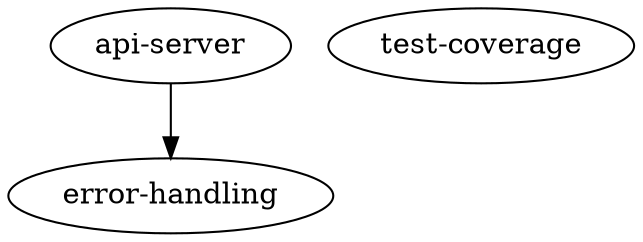

# Bootstrap Project Setup for {{.ProjectName}}

**Platform**: {{.PlatformDisplayName}} ({{.Platform}})
**Container**: {{if .ContainerImage}}{{.ContainerImage}}{{else}}Not configured{{end}}
{{- if .DockerfilePath}}
**Dockerfile**: {{.DockerfilePath}}
{{- end}}
{{- if .GitRepoURL}}
**Repository**: {{.GitRepoURL}}
{{- end}}
**Total Issues**: {{.TotalFailures}}
{{- if .HasCriticalFailures}}
**Priority**: 🔴 **CRITICAL** - Infrastructure issues blocking development
{{- else}}
**Priority**: 🟡 **HIGH** - Infrastructure improvements needed
{{- end}}

## Task Overview

This story addresses infrastructure issues discovered during project initialization. The following problems must be resolved before development can proceed effectively:

{{- if gt .TotalFailures 0}}
{{- range .FailuresByPriority}}
{{- if eq .Priority 1}}
- 🔴 **CRITICAL**: {{.Description}} ({{.Component}})
{{- else if eq .Priority 2}}
- 🟡 **HIGH**: {{.Description}} ({{.Component}})
{{- else}}
- 🟢 **MEDIUM**: {{.Description}} ({{.Component}})
{{- end}}
{{- end}}
{{- else}}
*No infrastructure issues detected. Proceeding with standard setup.*
{{- end}}

## Acceptance Criteria

{{- if .HasFailuresOfType "build_system"}}

### Build System Setup
{{- range .BuildSystemFailures}}
- [ ] Fix {{.Component}}: {{.Description}}
  {{- if .Details.target}}
  - Create `{{.Details.target}}` target in Makefile
  {{- end}}
  {{- if .Details.action}}
  - Action: {{.Details.action}}
  {{- end}}
{{- end}}
{{- if and .Pack .Pack.MakefileTargets.Build}}
- [ ] Verify build target works: `make build`
- [ ] Verify test target works: `make test`
{{- if .Pack.MakefileTargets.Lint}}
- [ ] Verify lint target works: `make lint`
{{- end}}
{{- if .Pack.MakefileTargets.Run}}
- [ ] Verify run target works: `make run`
{{- end}}
{{- end}}
{{- end}}

{{- if .HasFailuresOfType "container"}}

### Container Infrastructure
{{- range .ContainerFailures}}
- [ ] Resolve container issue: {{.Description}}
  {{- if .Details.image_name}}
  - Image: {{.Details.image_name}}
  {{- end}}
  {{- if .Details.dockerfile_path}}
  - Dockerfile: {{.Details.dockerfile_path}}
  {{- end}}
  {{- if .Details.error_message}}
  - Error: {{.Details.error_message}}
  {{- end}}
{{- end}}
- [ ] Validate container can run build and test commands
- [ ] Ensure rootless execution works with `--user=1000:1000 --read-only --network=none`

#### Dockerfile Location:
- Create `.maestro/Dockerfile` for the development container (this is the default path)
- Alternative: `.maestro/Dockerfile.variant` if multiple development containers are needed
- All container tools (`container_build`, `container_update`) require Dockerfiles to be in `.maestro/`
- This avoids conflicts with production Dockerfiles in the repository root

#### Base Image and Toolchain:
{{- if and .Pack .Pack.RecommendedBaseImage}}
- **Recommended base image**: `{{.Pack.RecommendedBaseImage}}`
{{- end}}
{{- if and .Pack .Pack.LanguageVersion}}
- **Required toolchain**: {{.Pack.DisplayName}} {{.Pack.LanguageVersion}} compiler/runtime
{{- end}}
- Container MUST include the language toolchain needed to build and run the application

#### MANDATORY Container Requirements:
- [ ] **Language Toolchain**: Container MUST have {{if .Pack}}{{.Pack.DisplayName}}{{else}}the required language{{end}} compiler/runtime installed
{{- if and .Pack .Pack.RecommendedBaseImage}}
  - Use base image `{{.Pack.RecommendedBaseImage}}` which includes the toolchain
{{- end}}
- [ ] **User UID 1000**: Container MUST have a user with UID 1000 pre-created
  ```dockerfile
  # REQUIRED: Maestro runs containers with --user 1000:1000 --read-only
  RUN adduser -D -u 1000 coder || useradd -u 1000 -m coder
  ```
- [ ] **Git CLI**: Container MUST have `git` installed
  ```dockerfile
  RUN apk add --no-cache git || apt-get update && apt-get install -y git
  ```
  - Note: GitHub CLI (gh) is NOT required - PR operations run on the host
- [ ] **EXPOSE Directive**: Container MUST expose the application port for demo mode
  ```dockerfile
  EXPOSE 8080  # Use your application's actual port
  ```
{{- end}}

{{- if .HasFailuresOfType "binary_size"}}

### Large File Management
{{- range .BinarySizeFailures}}
- [ ] Address large file: {{.Details.file_path}} ({{.Details.file_size}})
  {{- if eq .Details.action "setup_git_lfs"}}
  - Set up Git LFS for files over {{.Details.threshold}}
  - Run: `git lfs track "{{.Details.file_path}}"`
  {{- end}}
{{- end}}
- [ ] Verify no files exceed 100MB hard limit
- [ ] Configure Git LFS if needed for 50MB+ files
{{- end}}

{{- if .HasFailuresOfType "git_access"}}

### Git Repository Access
{{- range .GitAccessFailures}}
- [ ] Fix git issue: {{.Description}}
  {{- if .Details.action}}
  - Action: {{.Details.action}}
  {{- end}}
{{- end}}
- [ ] Verify git mirror and worktree creation works
- [ ] Test SSH key access to repository
{{- end}}

{{- if .HasFailuresOfType "infrastructure"}}

### Maestro Infrastructure
{{- range .InfrastructureFailures}}
{{- if eq .Component "knowledge_graph"}}
- [ ] Create `.maestro/knowledge.dot` - Knowledge graph documenting codebase architecture
{{- else}}
- [ ] Fix infrastructure: {{.Description}}
{{- end}}
{{- end}}
- [ ] Verify .maestro directory structure

#### Knowledge Graph (`.maestro/knowledge.dot`)
The knowledge graph is a DOT-format file that documents codebase architecture, patterns, and rules for AI agents. It uses a specific schema with structured node attributes.

**Node Schema** - Each node MUST have these attributes:
- `type` (required): `component` | `interface` | `abstraction` | `datastore` | `external` | `pattern` | `rule`
- `level` (required): `architecture` | `implementation`
- `status` (required): `current` | `deprecated` | `future` | `legacy`
- `description` (required): Human-readable explanation
- `priority` (rules only): `critical` | `high` | `medium` | `low`
- Optional: `tag`, `component`, `path`, `example`

**Edge Relations** - Connections between nodes use:
- `calls`, `uses`, `implements`, `configured_with`
- `must_follow`, `must_not_use` (for rules)
- `superseded_by`, `supersedes`, `coexists_with`

**Example:**


**What to Document:**
- Architectural decisions and their rationale
- Code patterns that should be followed consistently
- Critical rules (test coverage, error handling, security)
- Component relationships and dependencies
- Deprecated patterns (status="deprecated") agents should avoid
{{- end}}

{{- if .HasFailuresOfType "external_tools"}}

### External Dependencies
{{- range .ExternalToolFailures}}
- [ ] Install missing tool: {{.Description}}
{{- end}}
- [ ] Verify all required tools are in PATH
- [ ] Check GITHUB_TOKEN environment variable
{{- end}}

{{- if and .Pack .Pack.TemplateSections.ModuleSetup}}

{{.Pack.TemplateSections.ModuleSetup}}
{{- end}}

## Implementation Plan

### Phase 1: Critical Infrastructure (Priority 1)
{{- $hasCritical := false}}
{{- range .FailuresByPriority}}
{{- if eq .Priority 1}}
{{- $hasCritical = true}}
{{- if eq .Type "build_system"}}

**Build System Repair**:
1. Analyze existing build configuration
2. Create/fix Makefile with standard targets
3. Test each target in container environment
4. Ensure platform-specific build commands work

{{- else if eq .Type "container"}}

**Container Setup**:
1. Diagnose container validation failure
2. {{if $.RequiresNetworkAccess}}Enable network access temporarily for setup{{else}}Fix container configuration{{end}}
3. Test image pull and basic container execution
4. Validate security constraints (rootless, read-only)

{{- else if eq .Type "binary_size"}}

**Large File Resolution** (blocking deployment):
1. Identify files over 100MB limit
2. Set up Git LFS or remove unnecessary large files
3. Add .gitattributes rules for future prevention

{{- end}}
{{- end}}
{{- end}}
{{- if not $hasCritical}}
*No critical infrastructure issues found.*
{{- end}}

### Phase 2: Development Quality Setup

{{- if and .Pack .Pack.TemplateSections.LintConfig}}

{{.Pack.TemplateSections.LintConfig}}
{{- else}}
**Linting Configuration**: Set up linting for code quality
- Configure platform-appropriate linting tools
- Integrate linting into `make lint` target
- Ensure linting passes before proceeding
{{- end}}

**Pre-commit Hooks**: Enforce quality gates automatically
- Create `.git/hooks/pre-commit` requiring build, test, and lint success
- Make hook executable: `chmod +x .git/hooks/pre-commit`
- Test hook blocks commits on failure

{{- if and .Pack .Pack.TemplateSections.QualitySetup}}

{{.Pack.TemplateSections.QualitySetup}}
{{- end}}

### Phase 3: High Priority Infrastructure Fixes (Priority 2+)
{{- $hasHighPriority := false}}
{{- range .FailuresByPriority}}
{{- if gt .Priority 1}}
{{- $hasHighPriority = true}}
1. **{{.Component}}**: {{.Description}}
   {{- if .Details.action}}
   - Action: {{.Details.action}}
   {{- end}}
   {{- if .Details.file_path}}
   - File: {{.Details.file_path}}
   {{- end}}
{{- end}}
{{- end}}
{{- if not $hasHighPriority}}
*No high priority fixes required.*
{{- end}}

### Phase 4: Validation
1. Run full verification suite: `maestro init --verify`
2. Test complete development workflow:
   - `make build` - should compile successfully
   - `make test` - should run tests
   - `make lint` - should pass linting
   - `make run` - should start application
3. Verify container security constraints
4. Test git operations (clone, worktree, PR creation)

## Technical Notes

### Platform: {{.PlatformDisplayName}}
{{- if .Pack}}
{{- if .Pack.LanguageVersion}}
- **Language Version**: {{.Pack.LanguageVersion}}
{{- end}}
{{- if .Pack.Tooling.PackageManager}}
- **Package Manager**: {{.Pack.Tooling.PackageManager}}
{{- end}}
{{- if .Pack.Tooling.Linter}}
- **Linter**: {{.Pack.Tooling.Linter}}
{{- end}}
{{- if .Pack.Tooling.TestFramework}}
- **Test Framework**: {{.Pack.Tooling.TestFramework}}
{{- end}}
{{- end}}
- **Container Image**: {{if .ContainerImage}}{{.ContainerImage}}{{else}}Not configured{{end}}
{{- if .GitUserName}}
- **Git User**: {{.GitUserName}} <{{.GitUserEmail}}>
{{- end}}

{{- if and .Pack .Pack.MakefileTargets.Build}}

### Makefile Targets
The following targets should be configured in your Makefile:

```makefile
.PHONY: build test lint run clean

build:
	{{.Pack.MakefileTargets.Build}}

test:
	{{.Pack.MakefileTargets.Test}}
{{- if .Pack.MakefileTargets.Lint}}

lint:
	{{.Pack.MakefileTargets.Lint}}
{{- end}}
{{- if .Pack.MakefileTargets.Run}}

run:
	{{.Pack.MakefileTargets.Run}}
{{- end}}
{{- if .Pack.MakefileTargets.Clean}}

clean:
	{{.Pack.MakefileTargets.Clean}}
{{- end}}
```
{{- end}}

### Container Configuration
{{- if .RequiresNetworkAccess}}
- **Network Access**: Required during setup phase for image pull/build
- **Security**: Will be disabled after setup (`--network=none`)
{{- else}}
- **Network Access**: Disabled (`--network=none`)
{{- end}}
- **User**: Non-root (`--user=1000:1000`)
- **Filesystem**: Read-only with writable `/tmp`

### Required Tools in Container
The container must include these tools for Maestro operations:
- **git** - Version control operations (clone, commit, push, rebase)
- **curl** - Network operations and health checks (optional but recommended)

Install in Dockerfile:
```dockerfile
# Alpine-based images
RUN apk add --no-cache git curl

# Debian/Ubuntu-based images
RUN apt-get update && apt-get install -y git curl && rm -rf /var/lib/apt/lists/*
```

**Note**: GitHub CLI (`gh`) is NOT required in the container. All PR creation, merge operations, and GitHub API access run on the host orchestrator, not inside containers.

### File System Constraints
- **Large File Limit**: 100MB (GitHub push limit)
- **Warning Threshold**: 50MB (recommend Git LFS)
- **Git LFS**: {{if .HasFailuresOfType "binary_size"}}Required for large files{{else}}Not currently needed{{end}}

## Success Criteria

- [ ] All acceptance criteria completed
- [ ] Full verification suite passes
- [ ] Container security constraints validated
- [ ] Build/test/lint pipeline functional
- [ ] Git operations working
- [ ] No files exceed size limits

Upon completion, the bootstrap detector will automatically recognize the completed work on the next run and allow normal development workflow to proceed.

---

*Generated by Maestro Bootstrap System*
